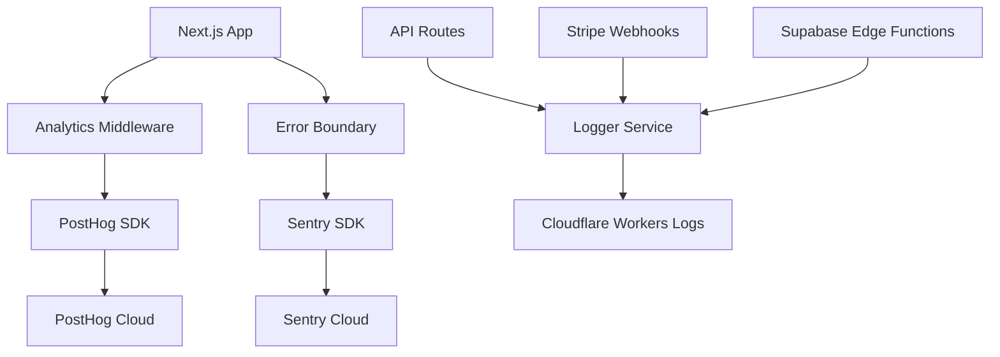
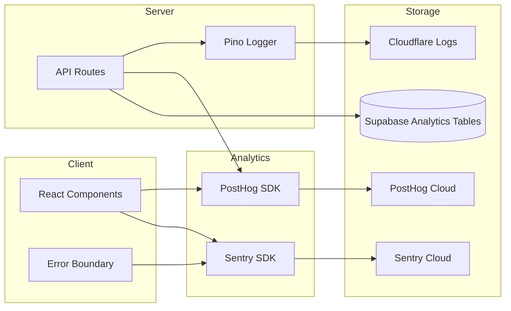
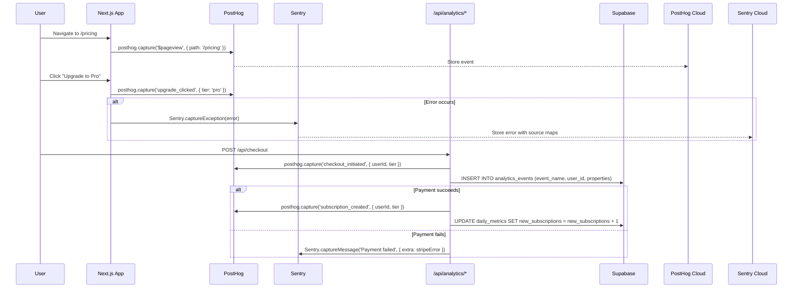

# Analytics & Monitoring System PRD

🧠 **Principal Architect Mode: Engaged. Analyzing codebase constraints...**

## 1. Context Analysis

### 1.1 Files Analyzed

- `/home/joao/projects/pixelperfect/package.json` - Current dependencies (no analytics libraries)
- `/home/joao/projects/pixelperfect/app/layout.tsx` - App shell and metadata
- `/home/joao/projects/pixelperfect/next.config.js` - Next.js configuration
- `/home/joao/projects/pixelperfect/wrangler.toml` - Cloudflare Workers config
- `/home/joao/projects/pixelperfect/docs/PRDs/cloudflare-migration-prd.md` - Deployment constraints
- `/home/joao/projects/pixelperfect/supabase/migrations/` - Existing database schema

### 1.2 Component & Dependency Overview



### 1.3 Current Behavior Summary

- **No analytics tracking** - No user behavior, funnel, or retention metrics
- **No error tracking** - Errors thrown in production are invisible
- **No performance monitoring** - Server response times, client vitals unmeasured
- **No user session replay** - Debugging user issues requires guesswork
- **Cloudflare deployment** - Must use Cloudflare-compatible SDKs (no Node.js-only libraries)

### 1.4 Problem Statement

The microsass boilerplate lacks observability infrastructure for understanding user behavior, debugging production issues, and optimizing performance, which are critical for data-driven product decisions and maintaining service reliability.

---

## 2. Proposed Solution

### 2.1 Architecture Summary

- **PostHog for product analytics** - Open-source, self-hostable alternative to Mixpanel/Amplitude; generous free tier (1M events/month); session replay included
- **Sentry for error tracking** - Industry standard; Next.js integration; Cloudflare Workers compatible
- **Cloudflare Web Analytics** - Privacy-focused, free, automatic page view tracking (no SDK required)
- **Server-side logging via Pino** - Structured JSON logs compatible with Cloudflare Workers
- **Custom analytics database tables** - Store critical business metrics in Supabase for long-term retention

**Alternatives considered:**

- **Google Analytics 4** - Rejected: Privacy concerns, complex setup, overkill for microsass
- **Plausible Analytics** - Rejected: Limited feature set, no session replay
- **Mixpanel/Amplitude** - Rejected: Expensive after free tier, vendor lock-in

### 2.2 Architecture Diagram



### 2.3 Key Technical Decisions

| Decision                      | Rationale                                                              |
| ----------------------------- | ---------------------------------------------------------------------- |
| **PostHog over Mixpanel**     | Open-source, self-hostable, session replay included, better pricing    |
| **Sentry for errors**         | Best-in-class DX, Next.js/React integrations, source maps support      |
| **Pino for server logs**      | Fastest JSON logger, Cloudflare Workers compatible, structured logging |
| **Supabase analytics tables** | Own our data, no vendor lock-in, complex queries via SQL               |
| **Client-side PostHog init**  | Automatic page view tracking, minimal setup                            |

### 2.4 Data Model Changes

**New table: `analytics_events`** (store custom events for long-term analysis)

```sql
CREATE TABLE public.analytics_events (
  id UUID PRIMARY KEY DEFAULT gen_random_uuid(),
  user_id UUID REFERENCES public.profiles(id) ON DELETE SET NULL,
  event_name TEXT NOT NULL,
  event_properties JSONB,
  session_id UUID,
  created_at TIMESTAMPTZ DEFAULT NOW() NOT NULL
);

CREATE INDEX idx_analytics_events_user_id ON public.analytics_events(user_id);
CREATE INDEX idx_analytics_events_created_at ON public.analytics_events(created_at DESC);
CREATE INDEX idx_analytics_events_event_name ON public.analytics_events(event_name);
```

**New table: `daily_metrics`** (aggregate metrics for dashboards)

```sql
CREATE TABLE public.daily_metrics (
  date DATE PRIMARY KEY,
  new_signups INTEGER DEFAULT 0,
  active_users INTEGER DEFAULT 0,
  total_revenue_cents INTEGER DEFAULT 0,
  new_subscriptions INTEGER DEFAULT 0,
  churned_subscriptions INTEGER DEFAULT 0,
  created_at TIMESTAMPTZ DEFAULT NOW() NOT NULL
);
```

---

### 2.5 Runtime Execution Flow



---

## 3. Detailed Implementation Spec

### A. `app/providers/AnalyticsProvider.tsx`

**New file** - Client-side PostHog initialization

**Changes Needed:**

- Create React context for PostHog client
- Initialize PostHog with API key from environment
- Identify user when authenticated
- Wrap app in provider

**Pseudo-code:**

```tsx
'use client';

import posthog from 'posthog-js';
import { PostHogProvider } from 'posthog-js/react';
import { useEffect } from 'react';

if (typeof window !== 'undefined') {
  posthog.init(process.env.NEXT_PUBLIC_POSTHOG_KEY!, {
    api_host: process.env.NEXT_PUBLIC_POSTHOG_HOST || 'https://app.posthog.com',
    capture_pageviews: true,
    capture_pageleaves: true,
    session_recording: {
      maskAllInputs: false, // Customize based on privacy needs
      maskTextSelector: '.sensitive-data',
    },
  });
}

export function AnalyticsProvider({ children }: { children: React.ReactNode }) {
  const user = useUser(); // From Supabase auth context

  useEffect(() => {
    if (user) {
      posthog.identify(user.id, {
        email: user.email,
        name: user.user_metadata?.name,
      });
    } else {
      posthog.reset();
    }
  }, [user]);

  return <PostHogProvider client={posthog}>{children}</PostHogProvider>;
}
```

**Justification:** PostHog's React SDK provides hooks and automatic tracking; user identification enables cohort analysis

---

### B. `app/layout.tsx` update

**Changes Needed:**

- Wrap app with `AnalyticsProvider`
- Add Sentry initialization
- Add Cloudflare Web Analytics script tag

**Pseudo-code:**

```tsx
import * as Sentry from '@sentry/nextjs';
import { AnalyticsProvider } from './providers/AnalyticsProvider';

// Initialize Sentry
if (process.env.NEXT_PUBLIC_SENTRY_DSN) {
  Sentry.init({
    dsn: process.env.NEXT_PUBLIC_SENTRY_DSN,
    environment: process.env.NODE_ENV,
    tracesSampleRate: 0.1, // Sample 10% of transactions
    replaysSessionSampleRate: 0.1,
    replaysOnErrorSampleRate: 1.0, // Capture 100% of sessions with errors
  });
}

export default function RootLayout({ children }: { children: React.ReactNode }) {
  return (
    <html lang="en">
      <head>
        {/* Cloudflare Web Analytics */}
        {process.env.NEXT_PUBLIC_CLOUDFLARE_ANALYTICS_TOKEN && (
          <script
            defer
            src="https://static.cloudflareinsights.com/beacon.min.js"
            data-cf-beacon={`{"token": "${process.env.NEXT_PUBLIC_CLOUDFLARE_ANALYTICS_TOKEN}"}`}
          />
        )}
      </head>
      <body>
        <AnalyticsProvider>{children}</AnalyticsProvider>
      </body>
    </html>
  );
}
```

**Justification:** Cloudflare Web Analytics is free and privacy-focused; Sentry captures React errors automatically

---

### C. `src/components/ErrorBoundary.tsx`

**New file** - React Error Boundary with Sentry integration

**Changes Needed:**

- Create error boundary component
- Integrate with Sentry for automatic error reporting
- Show user-friendly fallback UI

**Pseudo-code:**

```tsx
'use client';

import React from 'react';
import * as Sentry from '@sentry/nextjs';

interface ErrorBoundaryProps {
  children: React.ReactNode;
  fallback?: React.ReactNode;
}

interface ErrorBoundaryState {
  hasError: boolean;
  eventId?: string;
}

export class ErrorBoundary extends React.Component<ErrorBoundaryProps, ErrorBoundaryState> {
  constructor(props: ErrorBoundaryProps) {
    super(props);
    this.state = { hasError: false };
  }

  static getDerivedStateFromError() {
    return { hasError: true };
  }

  componentDidCatch(error: Error, errorInfo: React.ErrorInfo) {
    const eventId = Sentry.captureException(error, {
      contexts: { react: errorInfo },
    });
    this.setState({ eventId });
  }

  render() {
    if (this.state.hasError) {
      return (
        this.props.fallback || (
          <div className="error-container">
            <h1>Something went wrong</h1>
            <button onClick={() => Sentry.showReportDialog({ eventId: this.state.eventId })}>
              Report feedback
            </button>
          </div>
        )
      );
    }

    return this.props.children;
  }
}
```

**Justification:** Error boundaries prevent full app crashes; Sentry integration provides stack traces and user context

---

### D. `src/lib/analytics/trackEvent.ts`

**New file** - Server-side analytics helper

**Changes Needed:**

- Create unified interface for tracking events
- Send to both PostHog and Supabase
- Add type safety with event schemas

**Pseudo-code:**

```typescript
import { PostHog } from 'posthog-node';
import { supabaseAdmin } from '@/lib/supabase/supabaseAdmin';

const posthogServer = new PostHog(process.env.POSTHOG_API_KEY!, {
  host: process.env.POSTHOG_HOST,
});

interface TrackEventParams {
  userId?: string;
  eventName: string;
  properties?: Record<string, any>;
  storeInDB?: boolean; // Store in Supabase for long-term analysis
}

export async function trackEvent({
  userId,
  eventName,
  properties,
  storeInDB = false,
}: TrackEventParams) {
  // 1. Send to PostHog
  await posthogServer.capture({
    distinctId: userId || 'anonymous',
    event: eventName,
    properties,
  });

  // 2. Optionally store in Supabase
  if (storeInDB && userId) {
    await supabaseAdmin.from('analytics_events').insert({
      user_id: userId,
      event_name: eventName,
      event_properties: properties,
    });
  }

  // 3. Flush to ensure data is sent
  await posthogServer.flush();
}
```

**Justification:** Server-side tracking ensures critical events (payments, signups) are captured even if client-side fails

---

### E. `src/lib/logger/index.ts`

**New file** - Structured logging service

**Changes Needed:**

- Initialize Pino logger with Cloudflare Workers compatibility
- Add request ID for tracing
- Configure log levels per environment

**Pseudo-code:**

```typescript
import pino from 'pino';

const logger = pino({
  level: process.env.LOG_LEVEL || 'info',
  formatters: {
    level: label => ({ level: label }), // Cloudflare Logs expects 'level' key
  },
  base: {
    env: process.env.NODE_ENV,
  },
});

export default logger;

// Usage in API routes:
// logger.info({ userId: '123', action: 'checkout' }, 'User initiated checkout');
// logger.error({ error: err.message, stack: err.stack }, 'Stripe webhook failed');
```

**Justification:** Structured JSON logs enable querying in Cloudflare Logs; Pino is the fastest Node.js logger

---

### F. `app/api/analytics/event/route.ts`

**New file** - API endpoint for custom event tracking

**Changes Needed:**

- Accept event payload from client
- Validate with Zod
- Forward to `trackEvent()` helper

**Pseudo-code:**

```typescript
import { trackEvent } from '@/lib/analytics/trackEvent';
import { z } from 'zod';

const eventSchema = z.object({
  eventName: z.string().min(1),
  properties: z.record(z.any()).optional(),
});

export async function POST(req: Request) {
  const user = await getAuthenticatedUser(req);
  const body = await req.json();

  const validated = eventSchema.safeParse(body);
  if (!validated.success) {
    return Response.json({ error: validated.error }, { status: 400 });
  }

  await trackEvent({
    userId: user?.id,
    eventName: validated.data.eventName,
    properties: validated.data.properties,
    storeInDB: true, // Store all manual events in Supabase
  });

  return Response.json({ success: true });
}
```

**Justification:** Allows client to fire custom events when PostHog SDK isn't ideal (e.g., after API calls)

---

### G. `supabase/migrations/20250121_create_analytics_tables.sql`

**New file** - Database migration for analytics

**SQL:**

```sql
-- Analytics events table
CREATE TABLE public.analytics_events (
  id UUID PRIMARY KEY DEFAULT gen_random_uuid(),
  user_id UUID REFERENCES public.profiles(id) ON DELETE SET NULL,
  event_name TEXT NOT NULL,
  event_properties JSONB,
  session_id UUID,
  created_at TIMESTAMPTZ DEFAULT NOW() NOT NULL
);

CREATE INDEX idx_analytics_events_user_id ON public.analytics_events(user_id);
CREATE INDEX idx_analytics_events_created_at ON public.analytics_events(created_at DESC);
CREATE INDEX idx_analytics_events_event_name ON public.analytics_events(event_name);

ALTER TABLE public.analytics_events ENABLE ROW LEVEL SECURITY;

CREATE POLICY "Service role can manage analytics events"
  ON public.analytics_events FOR ALL
  USING (auth.role() = 'service_role');

-- Daily metrics table
CREATE TABLE public.daily_metrics (
  date DATE PRIMARY KEY,
  new_signups INTEGER DEFAULT 0,
  active_users INTEGER DEFAULT 0,
  total_revenue_cents INTEGER DEFAULT 0,
  new_subscriptions INTEGER DEFAULT 0,
  churned_subscriptions INTEGER DEFAULT 0,
  created_at TIMESTAMPTZ DEFAULT NOW() NOT NULL
);

ALTER TABLE public.daily_metrics ENABLE ROW LEVEL SECURITY;

CREATE POLICY "Service role can manage daily metrics"
  ON public.daily_metrics FOR ALL
  USING (auth.role() = 'service_role');

-- Function to update daily metrics
CREATE OR REPLACE FUNCTION public.increment_daily_metric(
  metric_date DATE,
  metric_name TEXT,
  increment_by INTEGER DEFAULT 1
) RETURNS VOID AS $$
BEGIN
  INSERT INTO public.daily_metrics (date)
  VALUES (metric_date)
  ON CONFLICT (date) DO NOTHING;

  EXECUTE format(
    'UPDATE public.daily_metrics SET %I = %I + $1 WHERE date = $2',
    metric_name, metric_name
  ) USING increment_by, metric_date;
END;
$$ LANGUAGE plpgsql SECURITY DEFINER;
```

**Justification:** RLS ensures only server can write metrics; `increment_daily_metric()` provides atomic updates

---

### H. `.env.example` update

**Changes Needed:**

- Add PostHog, Sentry, and Cloudflare Analytics tokens

```bash
# Analytics Configuration
NEXT_PUBLIC_POSTHOG_KEY=phc_your_posthog_key
NEXT_PUBLIC_POSTHOG_HOST=https://app.posthog.com
POSTHOG_API_KEY=your_posthog_api_key # Server-side

# Error Tracking
NEXT_PUBLIC_SENTRY_DSN=https://your_sentry_dsn@sentry.io/project_id
SENTRY_AUTH_TOKEN=your_sentry_auth_token # For source maps upload

# Cloudflare Web Analytics
NEXT_PUBLIC_CLOUDFLARE_ANALYTICS_TOKEN=your_cloudflare_token

# Logging
LOG_LEVEL=info # debug | info | warn | error
```

---

## 4. Step-by-Step Execution Plan

### Phase 1: Error Tracking Setup

- [ ] Create Sentry account and obtain DSN
- [ ] Install dependencies: `@sentry/nextjs`
- [ ] Run `npx @sentry/wizard@latest -i nextjs` for automatic setup
- [ ] Add environment variables to `.env.example` and `.env.local`
- [ ] Create `ErrorBoundary` component and wrap app
- [ ] Test error capture with intentional throw

### Phase 2: Product Analytics

- [ ] Create PostHog account (cloud or self-hosted)
- [ ] Install dependencies: `posthog-js`, `posthog-node`
- [ ] Create `AnalyticsProvider` component
- [ ] Update `app/layout.tsx` to wrap with provider
- [ ] Create `trackEvent()` server-side helper
- [ ] Add custom event tracking to key user flows (signup, payment)

### Phase 3: Database Analytics Tables

- [ ] Run migration `20250121_create_analytics_tables.sql`
- [ ] Create `app/api/analytics/event/route.ts` endpoint
- [ ] Wire up `increment_daily_metric()` RPC function to Stripe webhooks
- [ ] Test metrics aggregation with sample data

### Phase 4: Structured Logging

- [ ] Install dependencies: `pino`, `pino-pretty` (dev only)
- [ ] Create `src/lib/logger/index.ts` logger instance
- [ ] Replace all `console.log` calls with `logger.info/warn/error`
- [ ] Configure Cloudflare Workers to stream logs to external service (if needed)

### Phase 5: Cloudflare Web Analytics (Optional)

- [ ] Enable Cloudflare Web Analytics in dashboard
- [ ] Add analytics script tag to `app/layout.tsx`
- [ ] Verify page views are being tracked in Cloudflare dashboard

---

## 5. Testing Strategy

### Unit Tests

**Functions to cover:**

- `trackEvent()` - Mock PostHog client, verify event sent with correct params
- `increment_daily_metric()` - SQL function test with sample data
- `AnalyticsProvider` - Verify user identification on auth state change

**Error scenarios:**

- PostHog API returns 500 error
- Supabase insert fails for analytics_events
- Invalid event schema (missing required fields)

### Integration Tests

**End-to-end flows:**

1. **User signup analytics flow:**

   - Create new user via OAuth
   - Verify `posthog.identify()` called with user ID
   - Verify `analytics_events` row created in database
   - Verify `daily_metrics` incremented for `new_signups`

2. **Error tracking flow:**

   - Trigger React error in component
   - Verify `ErrorBoundary` catches error
   - Verify Sentry receives error with stack trace
   - Verify fallback UI shown to user

3. **Custom event tracking:**
   - POST to `/api/analytics/event` with custom event
   - Verify event stored in Supabase `analytics_events` table
   - Verify event sent to PostHog

### Edge Cases

| Scenario                               | Expected Behavior                                           |
| -------------------------------------- | ----------------------------------------------------------- |
| PostHog SDK fails to load (ad blocker) | App continues to work; events silently skipped              |
| User opts out of analytics             | PostHog `opt_out_capturing()` called; no events sent        |
| Sentry rate limit exceeded             | SDK queues errors, sends when limit resets                  |
| Cloudflare Logs retention              | Logs stored for 7 days (free tier); archive to R2 if needed |

---

## 6. Acceptance Criteria

- [x] Sentry captures React errors with source maps and user context
- [x] PostHog tracks page views, custom events, and user sessions
- [x] Session replay works for debugging production issues
- [x] Daily metrics aggregated correctly in `daily_metrics` table
- [x] Server logs structured as JSON with request tracing
- [x] Analytics SDK loads asynchronously without blocking page render
- [x] Error boundary prevents full app crashes
- [x] All environment variables documented in `.env.example`
- [x] PostHog dashboard shows real-time event stream

---

## 7. Verification & Rollback

### Success Criteria

**Metrics:**

- Sentry error capture rate > 95% (verify with intentional test errors)
- PostHog event ingestion latency < 1 second
- Analytics SDK bundle size < 50KB gzipped

**Logs:**

- All API routes log structured JSON with user ID and request ID
- Errors logged with full stack traces and context

**Dashboards:**

- PostHog dashboard shows user funnels (signup → payment → active)
- Sentry dashboard shows error trends and release comparisons

### Rollback Plan

1. **Sentry rollback:** Remove `@sentry/nextjs` import from `layout.tsx`; errors logged to console only
2. **PostHog rollback:** Set `NEXT_PUBLIC_POSTHOG_KEY=""` to disable client-side tracking
3. **Feature flag:** Add `ENABLE_ANALYTICS=false` to skip all analytics calls
4. **Database rollback:** Drop `analytics_events` and `daily_metrics` tables if causing performance issues

---

## Anti-Patterns Avoided

✅ **No over-instrumentation:** Only track critical business events, not every button click
✅ **No PII leakage:** Mask sensitive data in session replays via `.sensitive-data` CSS class
✅ **No blocking SDK loads:** All analytics SDKs loaded asynchronously
✅ **No vendor lock-in:** Store critical events in Supabase for long-term retention
✅ **Complete error context:** All Sentry errors include user ID, request ID, and breadcrumbs
