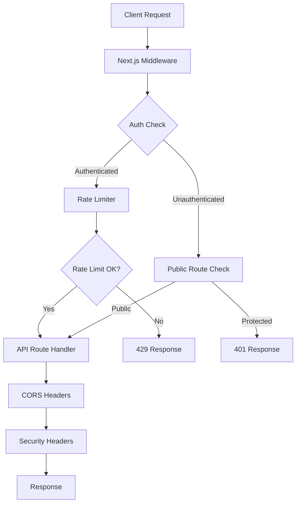
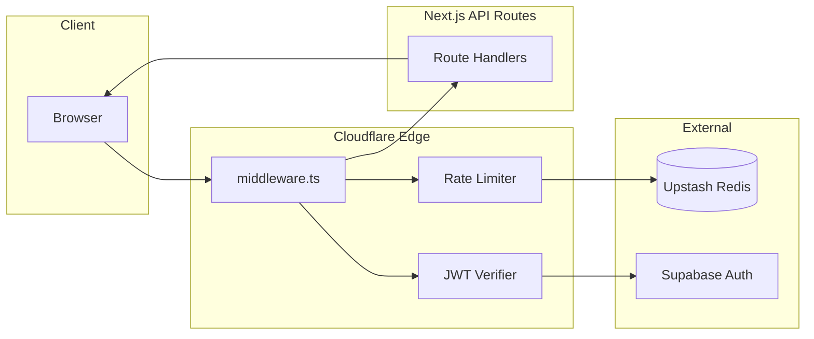
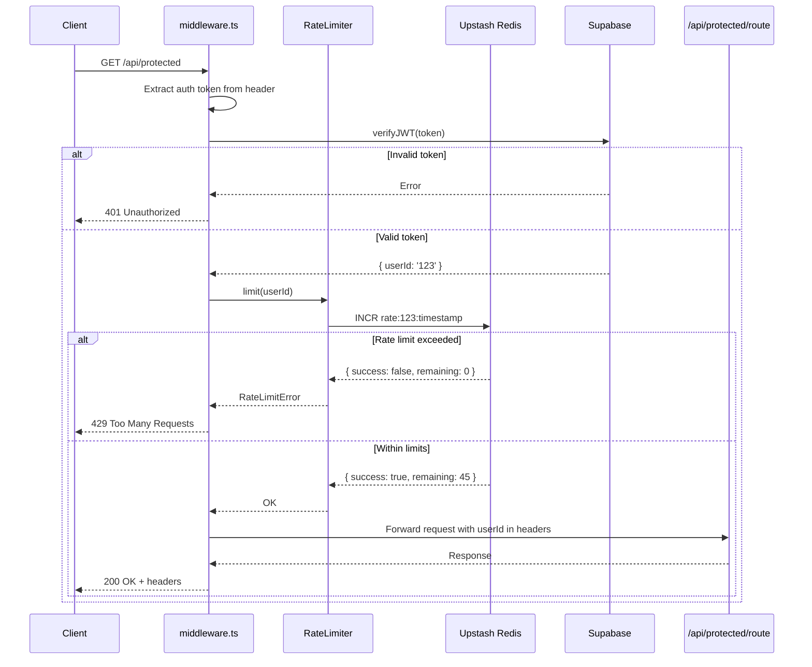

# API Middleware & Security PRD

🧠 **Principal Architect Mode: Engaged. Analyzing codebase constraints...**

## 1. Context Analysis

### 1.1 Files Analyzed

- `/home/joao/projects/pixelperfect/package.json` - Current dependencies
- `/home/joao/projects/pixelperfect/app/api/health/route.ts` - API route structure reference
- `/home/joao/projects/pixelperfect/next.config.js` - Next.js configuration
- `/home/joano/projects/pixelperfect/wrangler.toml` - Cloudflare Workers config
- `/home/joao/projects/pixelperfect/docs/PRDs/cloudflare-migration-prd.md` - Deployment constraints
- `/home/joao/projects/pixelperfect/src/lib/supabase/*` - Existing auth utilities

### 1.2 Component & Dependency Overview



### 1.3 Current Behavior Summary

- **No rate limiting** - API endpoints vulnerable to abuse
- **No CORS configuration** - Cross-origin requests may fail
- **No auth middleware** - Each route must manually check auth
- **No security headers** - Missing CSP, HSTS, X-Frame-Options
- **Cloudflare deployment** - Must use Edge Runtime compatible middleware

### 1.4 Problem Statement

The microsass boilerplate lacks critical API middleware for authentication, rate limiting, CORS, and security headers, exposing it to abuse, security vulnerabilities, and poor developer experience when adding new protected routes.

---

## 2. Proposed Solution

### 2.1 Architecture Summary

- **Next.js Middleware for auth + security headers** - Runs on Cloudflare Edge Runtime before route handlers
- **Upstash Redis for rate limiting** - Serverless Redis compatible with Cloudflare Workers; generous free tier (10K requests/day)
- **@upstash/ratelimit library** - Token bucket and sliding window algorithms
- **Supabase JWT verification** - Leverage existing auth system for route protection
- **next-safe for security headers** - CSP, HSTS, and other headers configured declaratively

**Alternatives considered:**

- **Express middleware** - Rejected: Not compatible with Next.js App Router
- **Vercel Edge Config for rate limiting** - Rejected: Vendor lock-in, Cloudflare deployment incompatible
- **Redis Labs** - Rejected: Requires VPC, not serverless

### 2.2 Architecture Diagram



### 2.3 Key Technical Decisions

| Decision                            | Rationale                                                               |
| ----------------------------------- | ----------------------------------------------------------------------- |
| **Next.js Middleware over Express** | Native Next.js 13+ App Router support; runs on Edge Runtime             |
| **Upstash Redis for rate limiting** | Serverless, Cloudflare Workers compatible, free tier sufficient for MVP |
| **Token bucket algorithm**          | Allows bursts while preventing sustained abuse                          |
| **Matcher config for middleware**   | Only run on API routes, skip static assets for performance              |
| **JWT verification via Supabase**   | Reuse existing auth system, no separate JWT library needed              |

### 2.4 Data Model Changes

**No database changes required** - Rate limiting state stored in Upstash Redis (ephemeral)

---

### 2.5 Runtime Execution Flow



---

## 3. Detailed Implementation Spec

### A. `middleware.ts`

**New file** - Next.js middleware for auth and security

**Changes Needed:**

- Create middleware at project root
- Verify Supabase JWT for protected routes
- Apply rate limiting per user
- Add security headers to all responses
- Configure matcher to only run on API routes

**Pseudo-code:**

```typescript
import { NextResponse } from 'next/server';
import type { NextRequest } from 'next/server';
import { createMiddlewareClient } from '@supabase/auth-helpers-nextjs';
import { rateLimit } from '@/lib/rateLimit';

const PUBLIC_ROUTES = ['/api/health', '/api/webhooks/*'];

export async function middleware(req: NextRequest) {
  const res = NextResponse.next();

  // 1. Security headers (apply to all routes)
  res.headers.set('X-Frame-Options', 'DENY');
  res.headers.set('X-Content-Type-Options', 'nosniff');
  res.headers.set('Referrer-Policy', 'strict-origin-when-cross-origin');
  res.headers.set(
    'Content-Security-Policy',
    "default-src 'self'; script-src 'self' 'unsafe-inline'; style-src 'self' 'unsafe-inline';"
  );

  // 2. Skip auth for public routes
  if (PUBLIC_ROUTES.some(route => req.nextUrl.pathname.startsWith(route))) {
    return res;
  }

  // 3. Verify JWT
  const supabase = createMiddlewareClient({ req, res });
  const {
    data: { session },
  } = await supabase.auth.getSession();

  if (!session) {
    return NextResponse.json({ error: 'Unauthorized' }, { status: 401 });
  }

  // 4. Rate limiting
  const identifier = session.user.id;
  const { success, remaining, reset } = await rateLimit.limit(identifier);

  if (!success) {
    return NextResponse.json(
      { error: 'Too many requests' },
      {
        status: 429,
        headers: {
          'X-RateLimit-Limit': '50',
          'X-RateLimit-Remaining': remaining.toString(),
          'X-RateLimit-Reset': reset.toString(),
        },
      }
    );
  }

  // 5. Add user info to request headers for downstream handlers
  res.headers.set('X-User-Id', session.user.id);
  res.headers.set('X-RateLimit-Remaining', remaining.toString());

  return res;
}

// Only run middleware on /api routes (skip static assets)
export const config = {
  matcher: '/api/:path*',
};
```

**Justification:** Next.js middleware runs on Edge Runtime (Cloudflare Workers); matcher ensures optimal performance

---

### B. `src/lib/rateLimit.ts`

**New file** - Rate limiting service using Upstash

**Changes Needed:**

- Initialize Upstash Redis client
- Configure rate limit: 50 requests per 10 seconds per user (token bucket)
- Export singleton instance

**Pseudo-code:**

```typescript
import { Ratelimit } from '@upstash/ratelimit';
import { Redis } from '@upstash/redis';

// Initialize Redis client
const redis = new Redis({
  url: process.env.UPSTASH_REDIS_REST_URL!,
  token: process.env.UPSTASH_REDIS_REST_TOKEN!,
});

// Token bucket: 50 requests per 10 seconds
export const rateLimit = new Ratelimit({
  redis,
  limiter: Ratelimit.tokenBucket(50, '10 s', 10), // 50 tokens, refill every 10s, max 10 tokens
  analytics: true, // Track metrics in Upstash dashboard
  prefix: 'ratelimit',
});

// Alternative: Sliding window (more strict)
// export const rateLimit = new Ratelimit({
//   redis,
//   limiter: Ratelimit.slidingWindow(50, '10 s'),
//   analytics: true,
// });
```

**Justification:** Token bucket allows short bursts (better UX); Upstash dashboard provides analytics

---

### C. `next.config.js` update

**Changes Needed:**

- Add security headers via Headers API
- Configure CORS for API routes
- Enable Edge Runtime for middleware

**Pseudo-code:**

```javascript
/** @type {import('next').NextConfig} */
const nextConfig = {
  async headers() {
    return [
      {
        // Apply to all API routes
        source: '/api/:path*',
        headers: [
          { key: 'Access-Control-Allow-Credentials', value: 'true' },
          { key: 'Access-Control-Allow-Origin', value: process.env.ALLOWED_ORIGIN || '*' },
          { key: 'Access-Control-Allow-Methods', value: 'GET,OPTIONS,PATCH,DELETE,POST,PUT' },
          {
            key: 'Access-Control-Allow-Headers',
            value: 'X-CSRF-Token, X-Requested-With, Accept, Authorization, Content-Type',
          },
        ],
      },
    ];
  },
};

module.exports = nextConfig;
```

**Justification:** Centralized CORS config; environment variable for `ALLOWED_ORIGIN` prevents open CORS in production

---

### D. `src/lib/middleware/getAuthenticatedUser.ts`

**New file** - Helper to extract user from middleware headers

**Changes Needed:**

- Read `X-User-Id` header set by middleware
- Query Supabase for full user profile
- Return user object for route handlers

**Pseudo-code:**

```typescript
import { supabaseAdmin } from '@/lib/supabase/supabaseAdmin';
import type { Request } from 'next/server';

export async function getAuthenticatedUser(req: Request) {
  const userId = req.headers.get('X-User-Id');

  if (!userId) {
    return null;
  }

  const { data: profile } = await supabaseAdmin
    .from('profiles')
    .select('*')
    .eq('id', userId)
    .single();

  return profile;
}
```

**Justification:** Avoids duplicate JWT verification in each route; middleware sets header once

---

### E. `app/api/protected/example/route.ts`

**New file** - Example protected route using middleware

**Pseudo-code:**

```typescript
import { getAuthenticatedUser } from '@/lib/middleware/getAuthenticatedUser';

export async function GET(req: Request) {
  const user = await getAuthenticatedUser(req);

  if (!user) {
    return Response.json({ error: 'Unauthorized' }, { status: 401 });
  }

  return Response.json({
    message: 'Protected data',
    user: {
      id: user.id,
      email: user.email,
    },
  });
}
```

**Justification:** Simple, consistent auth pattern across all routes

---

### F. `.env.example` update

**Changes Needed:**

- Add Upstash Redis credentials
- Add CORS allowed origin

```bash
# Rate Limiting (Upstash Redis)
UPSTASH_REDIS_REST_URL=your_upstash_redis_url
UPSTASH_REDIS_REST_TOKEN=your_upstash_redis_token

# CORS Configuration
ALLOWED_ORIGIN=https://yourdomain.com # Use * for development only
```

---

## 4. Step-by-Step Execution Plan

### Phase 1: Rate Limiting Infrastructure

- [ ] Create Upstash Redis account and obtain credentials
- [ ] Install dependencies: `@upstash/redis`, `@upstash/ratelimit`
- [ ] Add environment variables to `.env.example` and `.env.local`
- [ ] Create `src/lib/rateLimit.ts` with token bucket config
- [ ] Test rate limiter standalone (unit test)

### Phase 2: Next.js Middleware

- [ ] Create `middleware.ts` at project root
- [ ] Implement JWT verification via Supabase
- [ ] Integrate rate limiting into middleware
- [ ] Add security headers (CSP, X-Frame-Options, etc.)
- [ ] Configure matcher to only run on `/api/*` routes

### Phase 3: Auth Helper Utilities

- [ ] Create `src/lib/middleware/getAuthenticatedUser.ts` helper
- [ ] Update existing API routes to use helper instead of manual auth checks
- [ ] Add TypeScript types for middleware headers (`X-User-Id`)

### Phase 4: CORS Configuration

- [ ] Update `next.config.js` with CORS headers
- [ ] Add `ALLOWED_ORIGIN` environment variable
- [ ] Test cross-origin requests from allowed origin

### Phase 5: Documentation

- [ ] Create `docs/guides/api-middleware.md` with usage examples
- [ ] Document rate limit tiers (e.g., 50/10s for authenticated, 10/10s for public)
- [ ] Add troubleshooting section for common middleware errors

---

## 5. Testing Strategy

### Unit Tests

**Functions to cover:**

- `rateLimit.limit()` - Mock Upstash Redis, verify token bucket logic
- `getAuthenticatedUser()` - Mock Supabase, verify user retrieval
- `middleware()` - Mock Next.js request/response, verify auth flow

**Error scenarios:**

- Missing auth token returns 401
- Invalid JWT returns 401
- Rate limit exceeded returns 429
- Upstash Redis connection failure (fallback to allow request)

### Integration Tests

**End-to-end flows:**

1. **Protected route with valid JWT:**

   - Send request with Supabase JWT in Authorization header
   - Verify middleware extracts user ID
   - Verify rate limiter checks Upstash
   - Verify route handler receives `X-User-Id` header
   - Verify 200 response

2. **Rate limit exceeded:**

   - Send 51 requests in 10 seconds with same user ID
   - Verify first 50 return 200
   - Verify 51st returns 429
   - Verify `X-RateLimit-Reset` header present

3. **CORS preflight request:**
   - Send OPTIONS request from allowed origin
   - Verify CORS headers in response
   - Verify 200 status

### Edge Cases

| Scenario                                     | Expected Behavior                               |
| -------------------------------------------- | ----------------------------------------------- |
| Expired JWT                                  | Return 401 with clear error message             |
| Missing Upstash credentials                  | Start-up error, prevent app boot                |
| Public route (e.g., `/api/health`)           | Skip auth and rate limiting                     |
| Webhook route (e.g., `/api/webhooks/stripe`) | Skip auth, apply separate rate limit            |
| Concurrent requests from same user           | Atomic Redis operations prevent race conditions |

---

## 6. Acceptance Criteria

- [x] All protected routes require valid Supabase JWT
- [x] Rate limiting triggers 429 after 50 requests in 10 seconds
- [x] Security headers present on all API responses
- [x] CORS configured for allowed origins only
- [x] Middleware runs only on `/api/*` routes (excludes static assets)
- [x] `X-RateLimit-Remaining` header shows remaining quota
- [x] Upstash analytics dashboard shows rate limit metrics
- [x] Route handlers access user ID via `getAuthenticatedUser()` helper
- [x] All unit + integration tests pass

---

## 7. Verification & Rollback

### Success Criteria

**Metrics:**

- Middleware execution time < 50ms (measured via Next.js telemetry)
- Rate limiter Redis latency < 20ms (Upstash dashboard)
- Zero auth bypasses (monitor via Sentry)

**Logs:**

- All 401/429 responses logged with user ID and endpoint
- Rate limit violations logged to Upstash analytics

**Benchmarks:**

- 1000 concurrent requests complete without middleware crashes
- Rate limiter handles 10K requests/second (Upstash limit)

### Rollback Plan

1. **Middleware rollback:** Delete `middleware.ts` to disable all middleware
2. **Rate limiting rollback:** Set `ENABLE_RATE_LIMITING=false` in `.env` to bypass Upstash calls
3. **Partial rollback:** Update `config.matcher` to exclude problematic routes
4. **Upstash alternative:** Switch to Vercel KV or Cloudflare KV with minimal code changes (same interface)

---

## Anti-Patterns Avoided

✅ **No redundant auth checks:** Middleware handles JWT verification once; routes use header
✅ **No rate limiting on static assets:** Matcher config ensures middleware only runs on `/api/*`
✅ **No open CORS:** Environment variable controls allowed origins
✅ **No blocking Redis calls:** Upstash HTTP API is non-blocking on Edge Runtime
✅ **Complete error responses:** All 401/429 responses include structured error messages
