## Database Schema

> **Related Documentation**: [Architecture Overview](./architecture-overview.md)

This document details the Supabase database schema for the multi-platform community monitoring system.

---

### **Schema Overview**

The system uses four main tables to manage source monitoring across multiple platforms (Reddit, Hacker News, Product Hunt, Stack Overflow, Twitter, GitHub, Discord), content processing, AI analysis, and notifications.

```mermaid
erDiagram
    monitored_sources ||--o{ processed_content : "monitors"
    processed_content ||--o{ ai_analysis : "analyzes"
    ai_analysis ||--o{ notifications : "notifies"

    monitored_sources {
        uuid id PK
        text platform
        text source_identifier
        integer min_engagement_score
        integer min_comments
        text[] keywords
        boolean is_active
        jsonb platform_specific_config
        timestamp created_at
        timestamp updated_at
        constraint unique_platform_source UK
    }

    processed_content {
        uuid id PK
        text platform
        text external_content_id
        uuid source_id FK
        text source_name
        text content_type
        text title
        text content
        text author
        integer engagement_score
        integer comment_count
        text url
        text permalink
        jsonb platform_specific_data
        timestamp created_utc
        timestamp fetched_at
        constraint unique_platform_content UK
    }

    ai_analysis {
        uuid id PK
        uuid content_id FK
        text engagement_strategy
        text brand_opportunity
        text recommended_action
        float confidence_score
        text ai_model
        integer prompt_tokens
        integer completion_tokens
        timestamp created_at
    }

    notifications {
        uuid id PK
        uuid analysis_id FK
        boolean sent_to_telegram
        text telegram_message_id
        boolean is_read
        boolean is_engaged
        integer priority
        timestamp sent_at
        timestamp created_at
    }
```



---

### **Table Definitions**

#### **1. monitored_sources**

Stores configuration for sources being monitored across multiple platforms.

```sql
CREATE TABLE monitored_sources (
  id UUID PRIMARY KEY DEFAULT uuid_generate_v4(),
  platform TEXT NOT NULL CHECK (platform IN ('reddit', 'hackernews', 'producthunt', 'stackoverflow', 'twitter', 'github', 'discord')),
  source_identifier TEXT NOT NULL,
  min_engagement_score INTEGER DEFAULT 10,
  min_comments INTEGER DEFAULT 5,
  keywords TEXT[] DEFAULT '{}',
  is_active BOOLEAN DEFAULT true,
  platform_specific_config JSONB DEFAULT '{}'::jsonb,
  created_at TIMESTAMP WITH TIME ZONE DEFAULT NOW(),
  updated_at TIMESTAMP WITH TIME ZONE DEFAULT NOW(),
  CONSTRAINT unique_platform_source UNIQUE (platform, source_identifier)
);

-- Indexes
CREATE INDEX idx_monitored_sources_active ON monitored_sources(is_active);
CREATE INDEX idx_monitored_sources_platform ON monitored_sources(platform);
CREATE INDEX idx_monitored_sources_platform_active ON monitored_sources(platform, is_active);
CREATE INDEX idx_monitored_sources_source_identifier ON monitored_sources(source_identifier);
```

**Fields:**
- `id`: Unique identifier
- `platform`: Platform type (reddit, hackernews, producthunt, stackoverflow, twitter, github, discord)
- `source_identifier`: Platform-specific source identifier (e.g., subreddit name, HN section, GitHub repo)
- `min_engagement_score`: Minimum engagement threshold (upvotes for Reddit, points for HN, etc.)
- `min_comments`: Minimum comment count threshold
- `keywords`: Array of keywords to filter content (optional)
- `is_active`: Enable/disable monitoring for this source
- `platform_specific_config`: JSONB field for flexible platform-specific configuration
- `created_at`: Record creation timestamp
- `updated_at`: Last update timestamp

**Platform-Specific Examples:**
- **Reddit**: `platform='reddit'`, `source_identifier='webdev'`
- **Hacker News**: `platform='hackernews'`, `source_identifier='newest'`
- **Product Hunt**: `platform='producthunt'`, `source_identifier='developer-tools'`
- **GitHub**: `platform='github'`, `source_identifier='facebook/react'`
- **Stack Overflow**: `platform='stackoverflow'`, `source_identifier='javascript'`

---

#### **2. processed_content**

Stores content from multiple platforms that has been fetched and processed.

```sql
CREATE TABLE processed_content (
  id UUID PRIMARY KEY DEFAULT uuid_generate_v4(),
  platform TEXT NOT NULL CHECK (platform IN ('reddit', 'hackernews', 'producthunt', 'stackoverflow', 'twitter', 'github', 'discord')),
  external_content_id TEXT NOT NULL,
  source_id UUID REFERENCES monitored_sources(id) ON DELETE CASCADE,
  source_name TEXT NOT NULL,
  content_type TEXT DEFAULT 'post',
  title TEXT NOT NULL,
  content TEXT,
  author TEXT,
  engagement_score INTEGER DEFAULT 0,
  comment_count INTEGER DEFAULT 0,
  url TEXT NOT NULL,
  permalink TEXT,
  platform_specific_data JSONB DEFAULT '{}'::jsonb,
  created_utc TIMESTAMP WITH TIME ZONE,
  fetched_at TIMESTAMP WITH TIME ZONE DEFAULT NOW(),
  CONSTRAINT unique_platform_content UNIQUE (platform, external_content_id)
);

-- Indexes
CREATE INDEX idx_processed_content_external_id ON processed_content(external_content_id);
CREATE INDEX idx_processed_content_platform ON processed_content(platform);
CREATE INDEX idx_processed_content_source_name ON processed_content(source_name);
CREATE INDEX idx_processed_content_fetched_at ON processed_content(fetched_at DESC);
CREATE INDEX idx_processed_content_engagement_score ON processed_content(engagement_score DESC);
CREATE INDEX idx_processed_content_platform_source ON processed_content(platform, source_name);
```

**Fields:**
- `id`: Unique identifier
- `platform`: Source platform of this content
- `external_content_id`: Platform-specific unique content identifier (e.g., Reddit post ID, HN item ID)
- `source_id`: Foreign key to monitored_sources
- `source_name`: Display name of the source (e.g., subreddit name, repo name)
- `content_type`: Type of content (post, comment, question, discussion, issue, tweet, message)
- `title`: Content title
- `content`: Main text content
- `author`: Username or handle of content author
- `engagement_score`: Generic engagement metric (upvotes, points, stars, likes, reactions)
- `comment_count`: Comment/reply count
- `url`: Full URL to content
- `permalink`: Platform-specific permalink
- `platform_specific_data`: JSONB field for platform-specific data that doesn't fit standard schema
- `created_utc`: Content creation time on the platform
- `fetched_at`: When this content was fetched by our system

**Platform-Specific Engagement Metrics:**
- **Reddit**: upvotes
- **Hacker News**: points
- **Product Hunt**: votes
- **Stack Overflow**: score
- **Twitter**: likes
- **GitHub**: reaction count
- **Discord**: reaction count

---

#### **3. ai_analysis**

Stores AI-generated analysis and engagement strategies for content across all platforms.

```sql
CREATE TABLE ai_analysis (
  id UUID PRIMARY KEY DEFAULT uuid_generate_v4(),
  content_id UUID REFERENCES processed_content(id) ON DELETE CASCADE,
  engagement_strategy TEXT NOT NULL,
  brand_opportunity TEXT,
  recommended_action TEXT,
  confidence_score FLOAT CHECK (confidence_score >= 0 AND confidence_score <= 1),
  ai_model TEXT,
  prompt_tokens INTEGER,
  completion_tokens INTEGER,
  created_at TIMESTAMP WITH TIME ZONE DEFAULT NOW()
);

-- Indexes
CREATE INDEX idx_ai_analysis_content_id ON ai_analysis(content_id);
CREATE INDEX idx_ai_analysis_confidence ON ai_analysis(confidence_score DESC);
CREATE INDEX idx_ai_analysis_created_at ON ai_analysis(created_at DESC);

-- Enable Realtime
ALTER PUBLICATION supabase_realtime ADD TABLE ai_analysis;
```

**Fields:**
- `id`: Unique identifier
- `content_id`: Foreign key to processed_content (formerly post_id)
- `engagement_strategy`: AI-generated strategy for engaging with the content
- `brand_opportunity`: How the brand can be naturally mentioned
- `recommended_action`: Specific action to take
- `confidence_score`: AI confidence in the recommendation (0-1)
- `ai_model`: Which AI model was used for analysis
- `prompt_tokens`: Token count for cost tracking
- `completion_tokens`: Token count for cost tracking
- `created_at`: Analysis timestamp

**Note:** The AI analysis is platform-agnostic. The same analysis structure works across all platforms.

---

#### **4. notifications**

Tracks notification delivery status.

```sql
CREATE TABLE notifications (
  id UUID PRIMARY KEY DEFAULT uuid_generate_v4(),
  analysis_id UUID REFERENCES ai_analysis(id) ON DELETE CASCADE,
  sent_to_telegram BOOLEAN DEFAULT false,
  telegram_message_id TEXT,
  is_read BOOLEAN DEFAULT false,
  is_engaged BOOLEAN DEFAULT false,
  priority INTEGER DEFAULT 0,
  sent_at TIMESTAMP WITH TIME ZONE,
  created_at TIMESTAMP WITH TIME ZONE DEFAULT NOW()
);

-- Indexes
CREATE INDEX idx_notifications_analysis_id ON notifications(analysis_id);
CREATE INDEX idx_notifications_sent ON notifications(sent_to_telegram);
CREATE INDEX idx_notifications_read ON notifications(is_read);
CREATE INDEX idx_notifications_priority ON notifications(priority DESC);
```

**Fields:**
- `id`: Unique identifier
- `analysis_id`: Foreign key to ai_analysis
- `sent_to_telegram`: Whether notification was sent
- `telegram_message_id`: Telegram message ID for tracking
- `is_read`: User has viewed the notification
- `is_engaged`: User has engaged with the Reddit post
- `priority`: Higher values = more important (for sorting)
- `sent_at`: When notification was sent
- `created_at`: Record creation timestamp

---

### **Row Level Security (RLS) Policies**

Enable RLS on all tables:

```sql
-- Enable RLS
ALTER TABLE monitored_sources ENABLE ROW LEVEL SECURITY;
ALTER TABLE processed_content ENABLE ROW LEVEL SECURITY;
ALTER TABLE ai_analysis ENABLE ROW LEVEL SECURITY;
ALTER TABLE notifications ENABLE ROW LEVEL SECURITY;

-- Example policy (authenticated users can read all)
CREATE POLICY "Enable read access for authenticated users" ON monitored_sources
  FOR SELECT
  TO authenticated
  USING (true);

CREATE POLICY "Enable insert for authenticated users" ON monitored_sources
  FOR INSERT
  TO authenticated
  WITH CHECK (true);

-- Similar policies for other tables...
```

---

### **Realtime Configuration**

Enable Realtime on tables that need instant updates:

```sql
-- Enable Realtime for ai_analysis (new opportunities)
ALTER PUBLICATION supabase_realtime ADD TABLE ai_analysis;

-- Enable Realtime for notifications (delivery status)
ALTER PUBLICATION supabase_realtime ADD TABLE notifications;
```

---

### **Useful Queries**

#### Get Recent High-Confidence Opportunities (All Platforms)
```sql
SELECT
  c.platform,
  c.source_name,
  c.title,
  c.url,
  a.engagement_strategy,
  a.confidence_score,
  n.is_read,
  n.is_engaged
FROM ai_analysis a
JOIN processed_content c ON a.content_id = c.id
LEFT JOIN notifications n ON a.id = n.analysis_id
WHERE a.confidence_score > 0.7
ORDER BY a.created_at DESC
LIMIT 20;
```

#### Get Source Performance Stats (By Platform)
```sql
SELECT
  ms.platform,
  ms.source_identifier,
  COUNT(DISTINCT pc.id) as content_processed,
  COUNT(DISTINCT aa.id) as analyses_created,
  AVG(aa.confidence_score) as avg_confidence,
  COUNT(DISTINCT CASE WHEN n.is_engaged THEN n.id END) as engagements
FROM monitored_sources ms
LEFT JOIN processed_content pc ON ms.id = pc.source_id
LEFT JOIN ai_analysis aa ON pc.id = aa.content_id
LEFT JOIN notifications n ON aa.id = n.analysis_id
GROUP BY ms.id, ms.platform, ms.source_identifier
ORDER BY content_processed DESC;
```

#### Get Platform Statistics Summary
```sql
SELECT
  platform,
  COUNT(*) as active_sources,
  SUM(CASE WHEN is_active THEN 1 ELSE 0 END) as active_monitors,
  AVG(min_engagement_score) as avg_min_engagement
FROM monitored_sources
GROUP BY platform
ORDER BY active_sources DESC;
```

#### Get Content by Platform with Engagement Metrics
```sql
SELECT
  platform,
  COUNT(*) as total_content,
  AVG(engagement_score) as avg_engagement,
  MAX(engagement_score) as max_engagement,
  COUNT(DISTINCT source_name) as unique_sources
FROM processed_content
WHERE fetched_at > NOW() - INTERVAL '7 days'
GROUP BY platform
ORDER BY total_content DESC;
```

#### Reddit-Specific Query (Using Backward Compatibility View)
```sql
-- Still works with the old interface
SELECT * FROM monitored_subreddits WHERE is_active = true;
SELECT * FROM processed_posts WHERE upvotes > 100;
```

---

### **Migration Scripts**

See [deployment-guide.md](./deployment-guide.md) for complete migration setup instructions.
