# Community Monitor - System Flow Documentation

## Table of Contents
1. [System Overview](#system-overview)
2. [Architecture Diagram](#architecture-diagram)
3. [Data Flow](#data-flow)
4. [Component Architecture](#component-architecture)
5. [Authentication Flow](#authentication-flow)
6. [Platform Monitoring Flow](#platform-monitoring-flow)
7. [AI Processing Flow](#ai-processing-flow)
8. [User Interaction Flow](#user-interaction-flow)
9. [Real-time Updates](#real-time-updates)
10. [Deployment Architecture](#deployment-architecture)
11. [Platform-Specific Implementations](#platform-specific-implementations)

---

## System Overview

Community Monitor is a multi-platform full-stack application that automatically:
- **Monitors** multiple platforms (Reddit, Hacker News, Product Hunt, Stack Overflow, Twitter, GitHub, Discord)
- **Discovers** relevant content based on user-configured criteria
- **Analyzes** content using AI (Claude 3.5 Sonnet) for engagement opportunities
- **Notifies** users via Telegram when high-confidence opportunities are found
- **Provides** a web dashboard for managing monitors across all platforms and viewing opportunities

### Key Technologies
- **Frontend**: React 18 + TypeScript + Vite + TailwindCSS + DaisyUI
- **Backend**: Cloudflare Workers (serverless)
- **Database**: Supabase (PostgreSQL + Real-time)
- **Authentication**: Supabase Auth (Email, Google, Facebook, Azure)
- **State Management**: Zustand
- **AI**: OpenRouter API (Claude 3.5 Sonnet)
- **Notifications**: Telegram Bot API

---

## Architecture Diagram

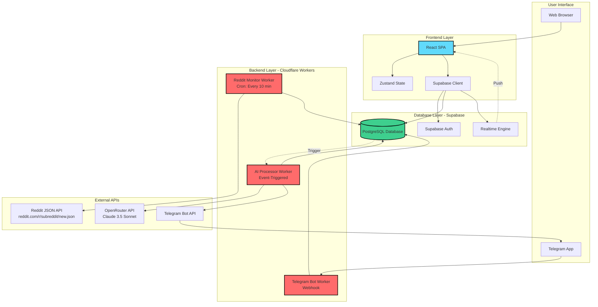
```mermaid
graph TB
    subgraph "User Interface"
        Browser[Web Browser]
        TelegramApp[Telegram App]
    end

    subgraph "Frontend Layer"
        React[React SPA]
        Zustand[Zustand State]
        SupabaseClient[Supabase Client]
    end

    subgraph "Backend Layer - Cloudflare Workers"
        RedditWorker[Reddit Monitor Worker<br/>Cron: Every 10 min]
        AIWorker[AI Processor Worker<br/>Event-Triggered]
        TelegramWorker[Telegram Bot Worker<br/>Webhook]
    end

    subgraph "External APIs"
        RedditAPI[Reddit JSON API<br/>reddit.com/r/subreddit/new.json]
        OpenRouter[OpenRouter API<br/>Claude 3.5 Sonnet]
        TelegramAPI[Telegram Bot API]
    end

    subgraph "Database Layer - Supabase"
        Auth[Supabase Auth]
        DB[(PostgreSQL Database)]
        Realtime[Realtime Engine]
    end

    Browser --> React
    React --> Zustand
    React --> SupabaseClient
    SupabaseClient --> Auth
    SupabaseClient --> DB
    SupabaseClient --> Realtime

    RedditWorker --> RedditAPI
    RedditWorker --> DB

    DB -.Trigger.-> AIWorker
    AIWorker --> OpenRouter
    AIWorker --> DB
    AIWorker --> TelegramAPI

    TelegramAPI --> TelegramApp
    TelegramApp --> TelegramWorker
    TelegramWorker --> DB

    Realtime -.Push.-> React

    style React fill:#61dafb,stroke:#000,stroke-width:2px
    style DB fill:#3ecf8e,stroke:#000,stroke-width:2px
    style RedditWorker fill:#ff6b6b,stroke:#000,stroke-width:2px
    style AIWorker fill:#ff6b6b,stroke:#000,stroke-width:2px
    style TelegramWorker fill:#ff6b6b,stroke:#000,stroke-width:2px
```

---

## Data Flow

### Complete End-to-End Flow

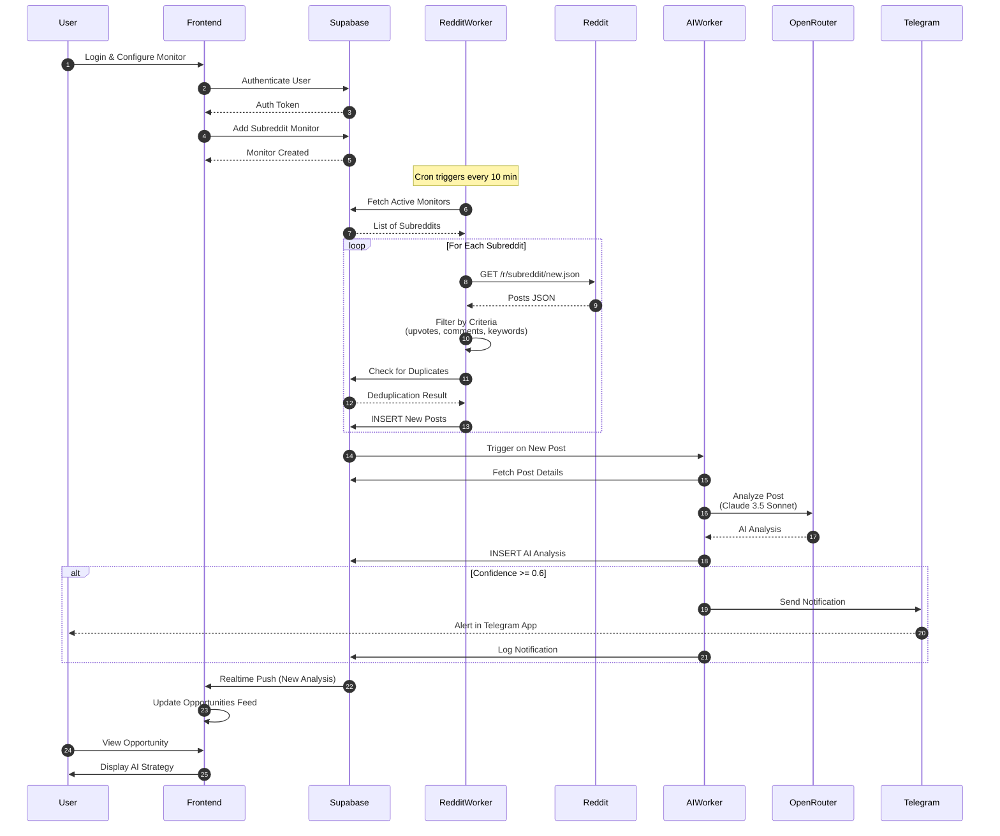
```mermaid
sequenceDiagram
    autonumber
    participant User
    participant Frontend
    participant Supabase
    participant RedditWorker
    participant Reddit
    participant AIWorker
    participant OpenRouter
    participant Telegram

    User->>Frontend: Login & Configure Monitor
    Frontend->>Supabase: Authenticate User
    Supabase-->>Frontend: Auth Token
    Frontend->>Supabase: Add Subreddit Monitor
    Supabase-->>Frontend: Monitor Created

    Note over RedditWorker: Cron triggers every 10 min

    RedditWorker->>Supabase: Fetch Active Monitors
    Supabase-->>RedditWorker: List of Subreddits

    loop For Each Subreddit
        RedditWorker->>Reddit: GET /r/subreddit/new.json
        Reddit-->>RedditWorker: Posts JSON
        RedditWorker->>RedditWorker: Filter by Criteria<br/>(upvotes, comments, keywords)
        RedditWorker->>Supabase: Check for Duplicates
        Supabase-->>RedditWorker: Deduplication Result
        RedditWorker->>Supabase: INSERT New Posts
    end

    Supabase->>AIWorker: Trigger on New Post
    AIWorker->>Supabase: Fetch Post Details

    AIWorker->>OpenRouter: Analyze Post<br/>(Claude 3.5 Sonnet)
    OpenRouter-->>AIWorker: AI Analysis

    AIWorker->>Supabase: INSERT AI Analysis

    alt Confidence >= 0.6
        AIWorker->>Telegram: Send Notification
        Telegram-->>User: Alert in Telegram App
        AIWorker->>Supabase: Log Notification
    end

    Supabase->>Frontend: Realtime Push (New Analysis)
    Frontend->>Frontend: Update Opportunities Feed
    User->>Frontend: View Opportunity
    Frontend->>User: Display AI Strategy
```

---

## Component Architecture

### Frontend Component Hierarchy

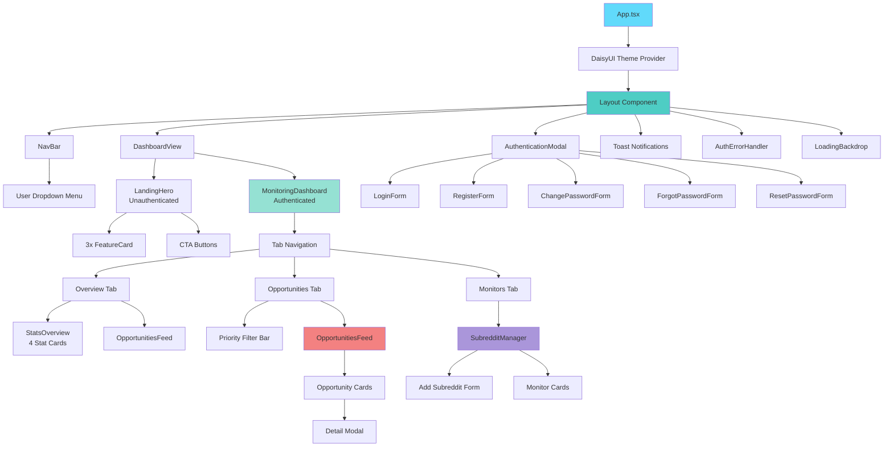
```mermaid
graph TD
    App[App.tsx]
    App --> Theme[DaisyUI Theme Provider]
    Theme --> Layout[Layout Component]

    Layout --> NavBar[NavBar]
    Layout --> Dashboard[DashboardView]
    Layout --> AuthModal[AuthenticationModal]
    Layout --> Toast[Toast Notifications]
    Layout --> AuthError[AuthErrorHandler]
    Layout --> Loading[LoadingBackdrop]

    NavBar --> UserMenu[User Dropdown Menu]

    Dashboard --> LandingHero[LandingHero<br/>Unauthenticated]
    Dashboard --> MonitoringDashboard[MonitoringDashboard<br/>Authenticated]

    LandingHero --> FeatureCards[3x FeatureCard]
    LandingHero --> CTAButtons[CTA Buttons]

    MonitoringDashboard --> Tabs[Tab Navigation]
    Tabs --> OverviewTab[Overview Tab]
    Tabs --> OpportunitiesTab[Opportunities Tab]
    Tabs --> MonitorsTab[Monitors Tab]

    OverviewTab --> StatsOverview[StatsOverview<br/>4 Stat Cards]
    OverviewTab --> OpportunitiesFeed1[OpportunitiesFeed]

    OpportunitiesTab --> FilterBar[Priority Filter Bar]
    OpportunitiesTab --> OpportunitiesFeed2[OpportunitiesFeed]

    OpportunitiesFeed2 --> OpportunityCard[Opportunity Cards]
    OpportunityCard --> DetailModal[Detail Modal]

    MonitorsTab --> SubredditManager[SubredditManager]
    SubredditManager --> AddForm[Add Subreddit Form]
    SubredditManager --> MonitorCards[Monitor Cards]

    AuthModal --> LoginForm[LoginForm]
    AuthModal --> RegisterForm[RegisterForm]
    AuthModal --> ChangePassword[ChangePasswordForm]
    AuthModal --> ForgotPassword[ForgotPasswordForm]
    AuthModal --> ResetPassword[ResetPasswordForm]

    style App fill:#61dafb
    style Layout fill:#4ecdc4
    style MonitoringDashboard fill:#95e1d3
    style OpportunitiesFeed2 fill:#f38181
    style SubredditManager fill:#aa96da
```

### State Management Architecture

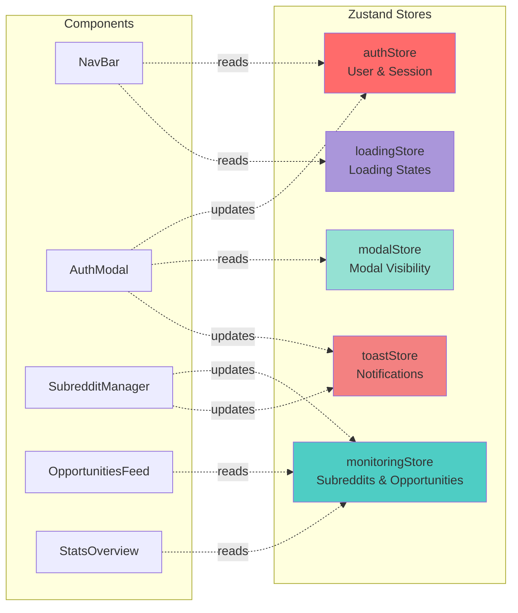
```mermaid
graph LR
    subgraph "Zustand Stores"
        AuthStore[authStore<br/>User & Session]
        MonitoringStore[monitoringStore<br/>Subreddits & Opportunities]
        ModalStore[modalStore<br/>Modal Visibility]
        ToastStore[toastStore<br/>Notifications]
        LoadingStore[loadingStore<br/>Loading States]
    end

    subgraph "Components"
        NavBar[NavBar]
        AuthModal[AuthModal]
        SubredditManager[SubredditManager]
        OpportunitiesFeed[OpportunitiesFeed]
        StatsOverview[StatsOverview]
    end

    NavBar -.reads.-> AuthStore
    AuthModal -.updates.-> AuthStore
    AuthModal -.reads.-> ModalStore

    SubredditManager -.updates.-> MonitoringStore
    OpportunitiesFeed -.reads.-> MonitoringStore
    StatsOverview -.reads.-> MonitoringStore

    AuthModal -.updates.-> ToastStore
    SubredditManager -.updates.-> ToastStore

    NavBar -.reads.-> LoadingStore

    style AuthStore fill:#ff6b6b
    style MonitoringStore fill:#4ecdc4
    style ModalStore fill:#95e1d3
    style ToastStore fill:#f38181
    style LoadingStore fill:#aa96da
```

---

## Authentication Flow

### User Registration & Login

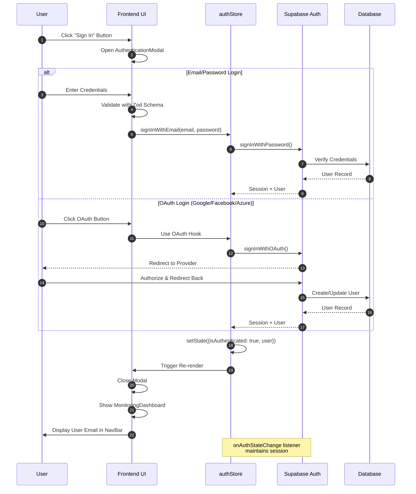
```mermaid
sequenceDiagram
    autonumber
    participant User
    participant UI as Frontend UI
    participant AuthStore as authStore
    participant SupabaseAuth as Supabase Auth
    participant DB as Database

    User->>UI: Click "Sign In" Button
    UI->>UI: Open AuthenticationModal

    alt Email/Password Login
        User->>UI: Enter Credentials
        UI->>UI: Validate with Zod Schema
        UI->>AuthStore: signInWithEmail(email, password)
        AuthStore->>SupabaseAuth: signInWithPassword()
        SupabaseAuth->>DB: Verify Credentials
        DB-->>SupabaseAuth: User Record
        SupabaseAuth-->>AuthStore: Session + User
    else OAuth Login (Google/Facebook/Azure)
        User->>UI: Click OAuth Button
        UI->>AuthStore: Use OAuth Hook
        AuthStore->>SupabaseAuth: signInWithOAuth()
        SupabaseAuth-->>User: Redirect to Provider
        User->>SupabaseAuth: Authorize & Redirect Back
        SupabaseAuth->>DB: Create/Update User
        DB-->>SupabaseAuth: User Record
        SupabaseAuth-->>AuthStore: Session + User
    end

    AuthStore->>AuthStore: setState({isAuthenticated: true, user})
    AuthStore->>UI: Trigger Re-render
    UI->>UI: Close Modal
    UI->>UI: Show MonitoringDashboard
    UI->>User: Display User Email in NavBar

    Note over SupabaseAuth,AuthStore: onAuthStateChange listener<br/>maintains session
```

### Password Reset Flow

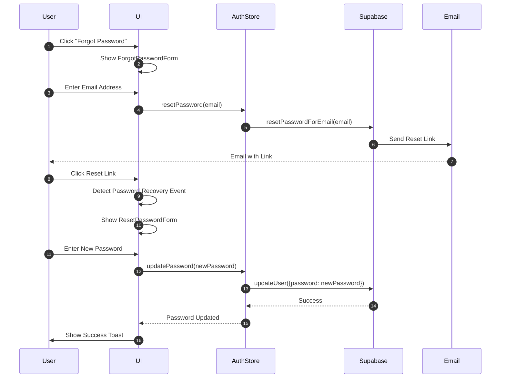
```mermaid
sequenceDiagram
    autonumber
    participant User
    participant UI
    participant AuthStore
    participant Supabase
    participant Email

    User->>UI: Click "Forgot Password"
    UI->>UI: Show ForgotPasswordForm
    User->>UI: Enter Email Address
    UI->>AuthStore: resetPassword(email)
    AuthStore->>Supabase: resetPasswordForEmail(email)
    Supabase->>Email: Send Reset Link
    Email-->>User: Email with Link

    User->>UI: Click Reset Link
    UI->>UI: Detect Password Recovery Event
    UI->>UI: Show ResetPasswordForm
    User->>UI: Enter New Password
    UI->>AuthStore: updatePassword(newPassword)
    AuthStore->>Supabase: updateUser({password: newPassword})
    Supabase-->>AuthStore: Success
    AuthStore-->>UI: Password Updated
    UI->>User: Show Success Toast
```

---

## Reddit Monitoring Flow

### Reddit Monitor Worker (Cloudflare Worker)

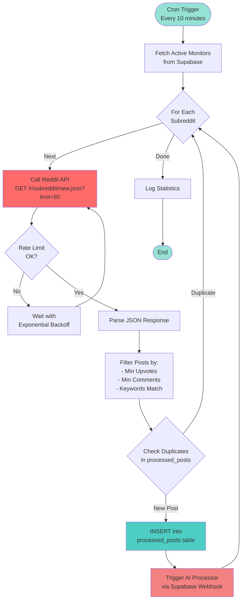
```mermaid
flowchart TD
    Start([Cron Trigger<br/>Every 10 minutes])
    Start --> FetchMonitors[Fetch Active Monitors<br/>from Supabase]

    FetchMonitors --> LoopStart{For Each<br/>Subreddit}

    LoopStart -->|Next| CallReddit[Call Reddit API<br/>GET /r/subreddit/new.json?limit=50]

    CallReddit --> CheckRate{Rate Limit<br/>OK?}
    CheckRate -->|No| Wait[Wait with<br/>Exponential Backoff]
    Wait --> CallReddit
    CheckRate -->|Yes| ParsePosts[Parse JSON Response]

    ParsePosts --> FilterPosts[Filter Posts by:<br/>- Min Upvotes<br/>- Min Comments<br/>- Keywords Match]

    FilterPosts --> CheckDupes{Check Duplicates<br/>in processed_posts}

    CheckDupes -->|Duplicate| LoopStart
    CheckDupes -->|New Post| InsertPost[INSERT into<br/>processed_posts table]

    InsertPost --> TriggerAI[Trigger AI Processor<br/>via Supabase Webhook]
    TriggerAI --> LoopStart

    LoopStart -->|Done| LogStats[Log Statistics]
    LogStats --> End([End])

    style Start fill:#95e1d3
    style End fill:#95e1d3
    style CallReddit fill:#ff6b6b
    style InsertPost fill:#4ecdc4
    style TriggerAI fill:#f38181
```

### Reddit API Integration Details

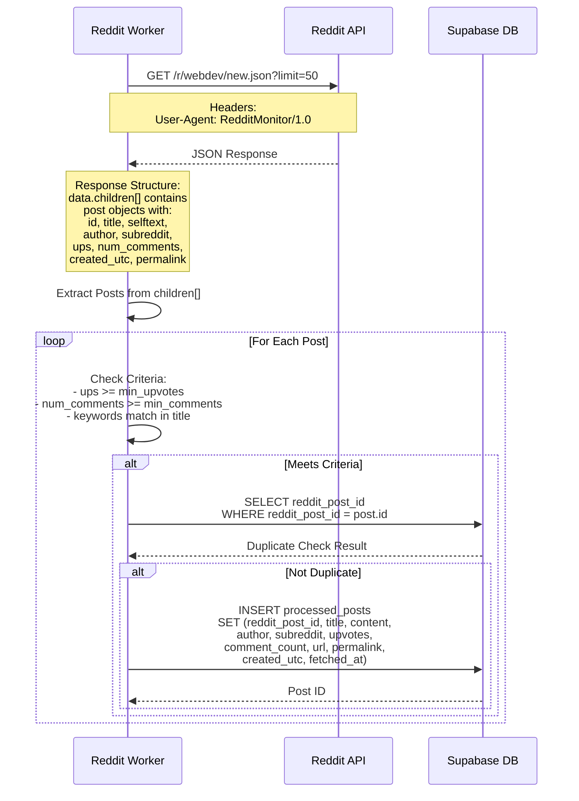
```mermaid
sequenceDiagram
    participant Worker as Reddit Worker
    participant Reddit as Reddit API
    participant Supabase as Supabase DB

    Worker->>Reddit: GET /r/webdev/new.json?limit=50
    Note over Worker,Reddit: Headers:<br/>User-Agent: RedditMonitor/1.0

    Reddit-->>Worker: JSON Response

    Note over Worker: Response Structure:<br/>data.children[] contains<br/>post objects with:<br/>id, title, selftext,<br/>author, subreddit,<br/>ups, num_comments,<br/>created_utc, permalink

    Worker->>Worker: Extract Posts from children[]

    loop For Each Post
        Worker->>Worker: Check Criteria:<br/>- ups >= min_upvotes<br/>- num_comments >= min_comments<br/>- keywords match in title

        alt Meets Criteria
            Worker->>Supabase: SELECT reddit_post_id<br/>WHERE reddit_post_id = post.id
            Supabase-->>Worker: Duplicate Check Result

            alt Not Duplicate
                Worker->>Supabase: INSERT processed_posts<br/>SET (reddit_post_id, title, content,<br/>author, subreddit, upvotes,<br/>comment_count, url, permalink,<br/>created_utc, fetched_at)
                Supabase-->>Worker: Post ID
            end
        end
    end
```

---

## AI Processing Flow

### AI Processor Worker

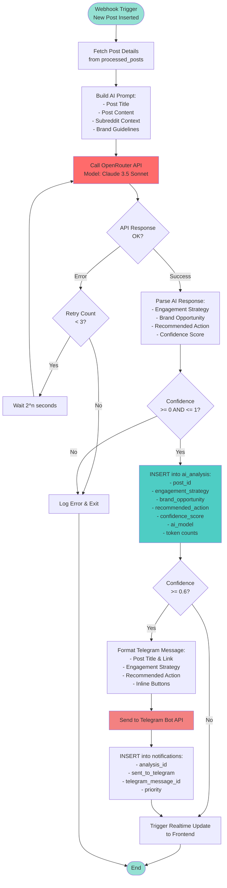
```mermaid
flowchart TD
    Start([Webhook Trigger<br/>New Post Inserted])
    Start --> FetchPost[Fetch Post Details<br/>from processed_posts]

    FetchPost --> BuildPrompt[Build AI Prompt:<br/>- Post Title<br/>- Post Content<br/>- Subreddit Context<br/>- Brand Guidelines]

    BuildPrompt --> CallAI[Call OpenRouter API<br/>Model: Claude 3.5 Sonnet]

    CallAI --> CheckResponse{API Response<br/>OK?}
    CheckResponse -->|Error| Retry{Retry Count<br/>< 3?}
    Retry -->|Yes| Wait[Wait 2^n seconds]
    Wait --> CallAI
    Retry -->|No| LogError[Log Error & Exit]

    CheckResponse -->|Success| ParseAI[Parse AI Response:<br/>- Engagement Strategy<br/>- Brand Opportunity<br/>- Recommended Action<br/>- Confidence Score]

    ParseAI --> ValidateScore{Confidence<br/>>= 0 AND <= 1?}
    ValidateScore -->|No| LogError
    ValidateScore -->|Yes| InsertAnalysis[INSERT into ai_analysis:<br/>- post_id<br/>- engagement_strategy<br/>- brand_opportunity<br/>- recommended_action<br/>- confidence_score<br/>- ai_model<br/>- token counts]

    InsertAnalysis --> CheckConfidence{Confidence<br/>>= 0.6?}

    CheckConfidence -->|Yes| FormatTelegram[Format Telegram Message:<br/>- Post Title & Link<br/>- Engagement Strategy<br/>- Recommended Action<br/>- Inline Buttons]

    FormatTelegram --> SendTelegram[Send to Telegram Bot API]
    SendTelegram --> LogNotification[INSERT into notifications:<br/>- analysis_id<br/>- sent_to_telegram<br/>- telegram_message_id<br/>- priority]

    CheckConfidence -->|No| RealtimeUpdate[Trigger Realtime Update<br/>to Frontend]
    LogNotification --> RealtimeUpdate

    RealtimeUpdate --> End([End])
    LogError --> End

    style Start fill:#95e1d3
    style End fill:#95e1d3
    style CallAI fill:#ff6b6b
    style InsertAnalysis fill:#4ecdc4
    style SendTelegram fill:#f38181
```

### AI Prompt Structure

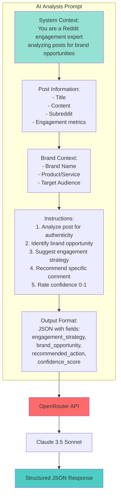
```mermaid
graph TB
    subgraph "AI Analysis Prompt"
        System[System Context:<br/>You are a Reddit engagement expert<br/>analyzing posts for brand opportunities]

        Post[Post Information:<br/>- Title<br/>- Content<br/>- Subreddit<br/>- Engagement metrics]

        Brand[Brand Context:<br/>- Brand Name<br/>- Product/Service<br/>- Target Audience]

        Instructions[Instructions:<br/>1. Analyze post for authenticity<br/>2. Identify brand opportunity<br/>3. Suggest engagement strategy<br/>4. Recommend specific comment<br/>5. Rate confidence 0-1]

        Format[Output Format:<br/>JSON with fields:<br/>engagement_strategy,<br/>brand_opportunity,<br/>recommended_action,<br/>confidence_score]
    end

    System --> Post
    Post --> Brand
    Brand --> Instructions
    Instructions --> Format

    Format --> OpenRouter[OpenRouter API]
    OpenRouter --> Claude[Claude 3.5 Sonnet]
    Claude --> Response[Structured JSON Response]

    style System fill:#95e1d3
    style OpenRouter fill:#ff6b6b
    style Response fill:#4ecdc4
```

---

## User Interaction Flow

### Adding a Subreddit Monitor

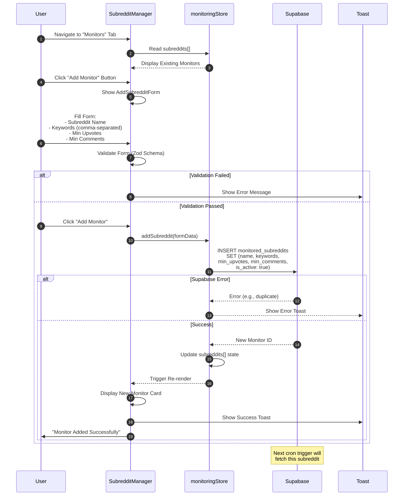
```mermaid
sequenceDiagram
    autonumber
    participant User
    participant UI as SubredditManager
    participant Store as monitoringStore
    participant Supabase
    participant Toast

    User->>UI: Navigate to "Monitors" Tab
    UI->>Store: Read subreddits[]
    Store-->>UI: Display Existing Monitors

    User->>UI: Click "Add Monitor" Button
    UI->>UI: Show AddSubredditForm

    User->>UI: Fill Form:<br/>- Subreddit Name<br/>- Keywords (comma-separated)<br/>- Min Upvotes<br/>- Min Comments

    UI->>UI: Validate Form (Zod Schema)

    alt Validation Failed
        UI->>Toast: Show Error Message
    else Validation Passed
        User->>UI: Click "Add Monitor"
        UI->>Store: addSubreddit(formData)
        Store->>Supabase: INSERT monitored_subreddits<br/>SET (name, keywords,<br/>min_upvotes, min_comments,<br/>is_active: true)

        alt Supabase Error
            Supabase-->>Store: Error (e.g., duplicate)
            Store-->>Toast: Show Error Toast
        else Success
            Supabase-->>Store: New Monitor ID
            Store->>Store: Update subreddits[] state
            Store-->>UI: Trigger Re-render
            UI->>UI: Display New Monitor Card
            UI->>Toast: Show Success Toast
            UI->>User: "Monitor Added Successfully"
        end
    end

    Note over Supabase: Next cron trigger will<br/>fetch this subreddit
```

### Viewing an Opportunity

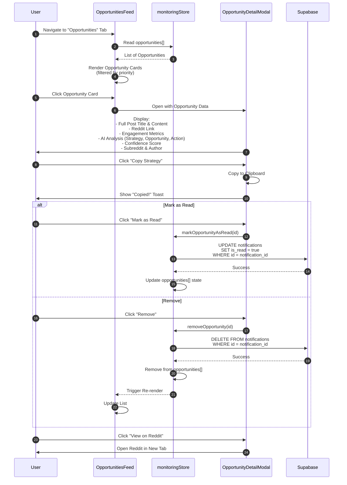
```mermaid
sequenceDiagram
    autonumber
    participant User
    participant Feed as OpportunitiesFeed
    participant Store as monitoringStore
    participant Modal as OpportunityDetailModal
    participant Supabase

    User->>Feed: Navigate to "Opportunities" Tab
    Feed->>Store: Read opportunities[]
    Store-->>Feed: List of Opportunities

    Feed->>Feed: Render Opportunity Cards<br/>(filtered by priority)

    User->>Feed: Click Opportunity Card
    Feed->>Modal: Open with Opportunity Data

    Modal->>User: Display:<br/>- Full Post Title & Content<br/>- Reddit Link<br/>- Engagement Metrics<br/>- AI Analysis (Strategy, Opportunity, Action)<br/>- Confidence Score<br/>- Subreddit & Author

    User->>Modal: Click "Copy Strategy"
    Modal->>Modal: Copy to Clipboard
    Modal->>User: Show "Copied!" Toast

    alt Mark as Read
        User->>Modal: Click "Mark as Read"
        Modal->>Store: markOpportunityAsRead(id)
        Store->>Supabase: UPDATE notifications<br/>SET is_read = true<br/>WHERE id = notification_id
        Supabase-->>Store: Success
        Store->>Store: Update opportunities[] state
    else Remove
        User->>Modal: Click "Remove"
        Modal->>Store: removeOpportunity(id)
        Store->>Supabase: DELETE FROM notifications<br/>WHERE id = notification_id
        Supabase-->>Store: Success
        Store->>Store: Remove from opportunities[]
        Store-->>Feed: Trigger Re-render
        Feed->>Feed: Update List
    end

    User->>Modal: Click "View on Reddit"
    Modal->>User: Open Reddit in New Tab
```

### Toggle Monitor On/Off

```mermaid
flowchart TD
    Start([User Clicks Toggle Switch])
    Start --> GetID[Get Monitor ID]

    GetID --> CallStore[Call monitoringStore.toggleSubreddit(id)]

    CallStore --> UpdateDB[UPDATE monitored_subreddits<br/>SET is_active = NOT is_active<br/>WHERE id = monitor_id]

    UpdateDB --> CheckResult{Supabase<br/>Success?}

    CheckResult -->|Error| ShowError[Show Error Toast]
    ShowError --> End([End])

    CheckResult -->|Success| UpdateState[Update Local State:<br/>subreddits[i].is_active = !is_active]

    UpdateState --> Rerender[Trigger UI Re-render]

    Rerender --> CheckActive{is_active<br/>true?}

    CheckActive -->|true| ShowEnabled[Show "Monitor Enabled" Toast<br/>+ Green Toggle State]
    CheckActive -->|false| ShowDisabled[Show "Monitor Disabled" Toast<br/>+ Gray Toggle State]

    ShowEnabled --> End
    ShowDisabled --> End

    style Start fill:#95e1d3
    style End fill:#95e1d3
    style UpdateDB fill:#4ecdc4
    style ShowError fill:#ff6b6b
```

---

## Real-time Updates

### Supabase Realtime Architecture

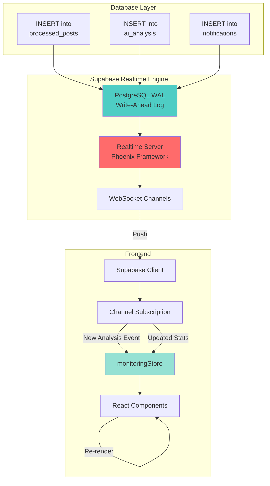
```mermaid
graph TB
    subgraph "Database Layer"
        PostInsert[INSERT into<br/>processed_posts]
        AnalysisInsert[INSERT into<br/>ai_analysis]
        NotifInsert[INSERT into<br/>notifications]
    end

    subgraph "Supabase Realtime Engine"
        WAL[PostgreSQL WAL<br/>Write-Ahead Log]
        Realtime[Realtime Server<br/>Phoenix Framework]
        Channels[WebSocket Channels]
    end

    subgraph "Frontend"
        Client[Supabase Client]
        Subscription[Channel Subscription]
        Store[monitoringStore]
        UI[React Components]
    end

    PostInsert --> WAL
    AnalysisInsert --> WAL
    NotifInsert --> WAL

    WAL --> Realtime
    Realtime --> Channels

    Channels -.Push.-> Client
    Client --> Subscription

    Subscription --> |New Analysis Event| Store
    Subscription --> |Updated Stats| Store

    Store --> UI
    UI --> |Re-render| UI

    style WAL fill:#4ecdc4
    style Realtime fill:#ff6b6b
    style Store fill:#95e1d3
```

### Realtime Event Flow

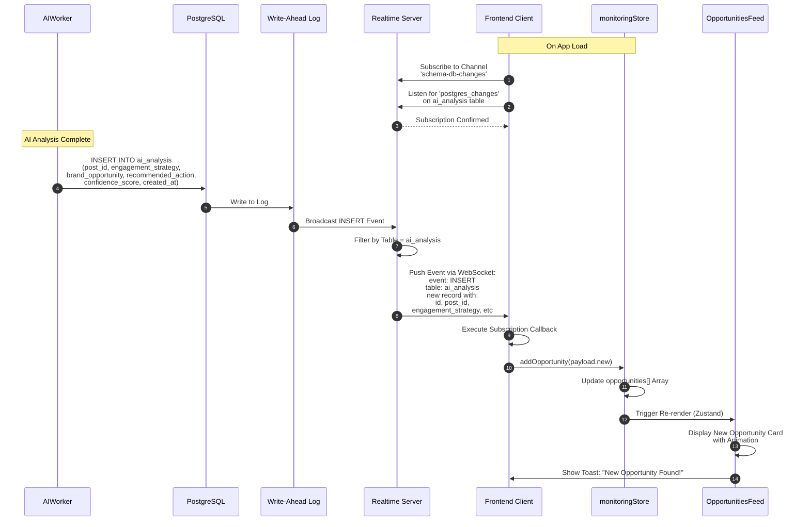
```mermaid
sequenceDiagram
    autonumber
    participant AIWorker
    participant DB as PostgreSQL
    participant WAL as Write-Ahead Log
    participant Realtime as Realtime Server
    participant Client as Frontend Client
    participant Store as monitoringStore
    participant UI as OpportunitiesFeed

    Note over Client,Store: On App Load
    Client->>Realtime: Subscribe to Channel<br/>'schema-db-changes'
    Client->>Realtime: Listen for 'postgres_changes'<br/>on ai_analysis table
    Realtime-->>Client: Subscription Confirmed

    Note over AIWorker: AI Analysis Complete
    AIWorker->>DB: INSERT INTO ai_analysis<br/>(post_id, engagement_strategy,<br/>brand_opportunity, recommended_action,<br/>confidence_score, created_at)

    DB->>WAL: Write to Log
    WAL->>Realtime: Broadcast INSERT Event

    Realtime->>Realtime: Filter by Table = ai_analysis
    Realtime->>Client: Push Event via WebSocket:<br/>event: INSERT<br/>table: ai_analysis<br/>new record with:<br/>id, post_id,<br/>engagement_strategy, etc

    Client->>Client: Execute Subscription Callback
    Client->>Store: addOpportunity(payload.new)
    Store->>Store: Update opportunities[] Array
    Store->>UI: Trigger Re-render (Zustand)

    UI->>UI: Display New Opportunity Card<br/>with Animation
    UI->>Client: Show Toast: "New Opportunity Found!"
```

### Frontend Subscription Implementation

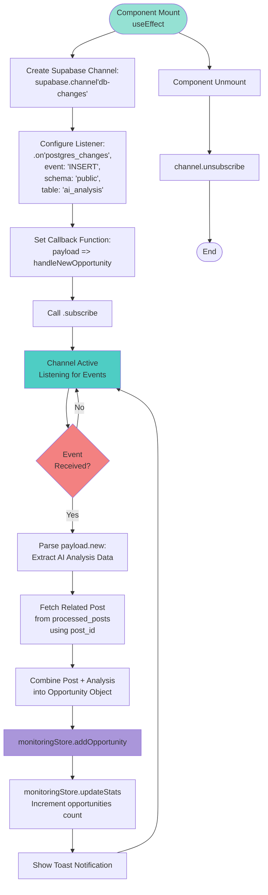
```mermaid
flowchart TD
    Start([Component Mount<br/>useEffect])

    Start --> CreateChannel[Create Supabase Channel:<br/>supabase.channel'db-changes']

    CreateChannel --> Configure[Configure Listener:<br/>.on'postgres_changes',<br/>event: 'INSERT',<br/>schema: 'public',<br/>table: 'ai_analysis']

    Configure --> SetCallback[Set Callback Function:<br/>payload => handleNewOpportunity]

    SetCallback --> Subscribe[Call .subscribe]

    Subscribe --> Active[Channel Active<br/>Listening for Events]

    Active --> EventReceived{Event<br/>Received?}

    EventReceived -->|No| Active
    EventReceived -->|Yes| ParsePayload[Parse payload.new:<br/>Extract AI Analysis Data]

    ParsePayload --> FetchPost[Fetch Related Post<br/>from processed_posts<br/>using post_id]

    FetchPost --> CombineData[Combine Post + Analysis<br/>into Opportunity Object]

    CombineData --> UpdateStore[monitoringStore.addOpportunity]

    UpdateStore --> UpdateStats[monitoringStore.updateStats<br/>Increment opportunities count]

    UpdateStats --> ShowToast[Show Toast Notification]

    ShowToast --> Active

    Start --> Cleanup[Component Unmount]
    Cleanup --> Unsubscribe[channel.unsubscribe]
    Unsubscribe --> End([End])

    style Start fill:#95e1d3
    style Active fill:#4ecdc4
    style EventReceived fill:#f38181
    style UpdateStore fill:#aa96da
```

---

## Deployment Architecture

### Production Deployment Diagram

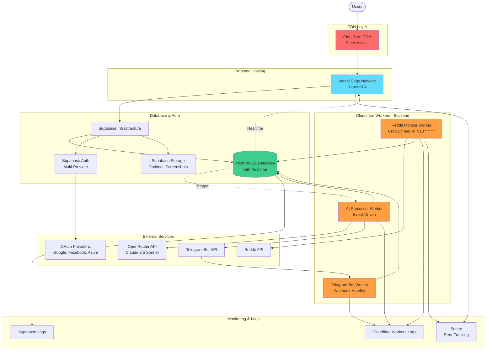
```mermaid
graph TB
    subgraph "CDN Layer"
        CloudflareCDN[Cloudflare CDN<br/>Static Assets]
    end

    subgraph "Frontend Hosting"
        VercelEdge[Vercel Edge Network<br/>React SPA]
    end

    subgraph "Cloudflare Workers - Backend"
        RedditCron[Reddit Monitor Worker<br/>Cron Schedule: */10 * * * *]
        AIProcessor[AI Processor Worker<br/>Event-Driven]
        TelegramBot[Telegram Bot Worker<br/>Webhook Handler]
    end

    subgraph "Database & Auth"
        SupabaseInfra[Supabase Infrastructure]
        PostgreSQL[(PostgreSQL Database<br/>with Realtime)]
        AuthService[Supabase Auth<br/>Multi-Provider]
        Storage[Supabase Storage<br/>Optional: Screenshots]
    end

    subgraph "External Services"
        RedditAPI[Reddit API]
        OpenRouterAPI[OpenRouter API<br/>Claude 3.5 Sonnet]
        TelegramAPI[Telegram Bot API]
        OAuthProviders[OAuth Providers:<br/>Google, Facebook, Azure]
    end

    subgraph "Monitoring & Logs"
        CloudflareLogs[Cloudflare Workers Logs]
        SupabaseLogs[Supabase Logs]
        Sentry[Sentry<br/>Error Tracking]
    end

    User([Users]) --> CloudflareCDN
    CloudflareCDN --> VercelEdge
    VercelEdge --> SupabaseInfra

    SupabaseInfra --> PostgreSQL
    SupabaseInfra --> AuthService
    SupabaseInfra --> Storage

    AuthService --> OAuthProviders

    RedditCron --> RedditAPI
    RedditCron --> PostgreSQL

    PostgreSQL -.Trigger.-> AIProcessor
    AIProcessor --> OpenRouterAPI
    AIProcessor --> PostgreSQL
    AIProcessor --> TelegramAPI

    TelegramAPI --> TelegramBot
    TelegramBot --> PostgreSQL

    PostgreSQL -.Realtime.-> VercelEdge

    RedditCron --> CloudflareLogs
    AIProcessor --> CloudflareLogs
    TelegramBot --> CloudflareLogs

    VercelEdge --> Sentry
    RedditCron --> Sentry

    PostgreSQL --> SupabaseLogs

    style CloudflareCDN fill:#ff6b6b
    style VercelEdge fill:#61dafb
    style PostgreSQL fill:#3ecf8e
    style RedditCron fill:#ff9f43
    style AIProcessor fill:#ff9f43
    style TelegramBot fill:#ff9f43
```

### Environment Configuration

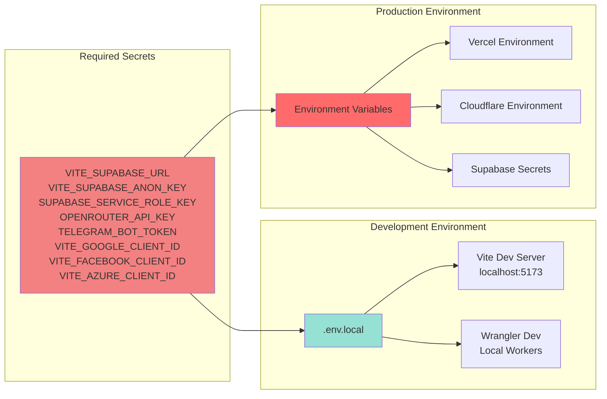
```mermaid
graph LR
    subgraph "Development Environment"
        DevEnv[.env.local]
        DevEnv --> DevFrontend[Vite Dev Server<br/>localhost:5173]
        DevEnv --> DevWorkers[Wrangler Dev<br/>Local Workers]
    end

    subgraph "Production Environment"
        ProdSecrets[Environment Variables]
        ProdSecrets --> VercelEnv[Vercel Environment]
        ProdSecrets --> CloudflareEnv[Cloudflare Environment]
        ProdSecrets --> SupabaseEnv[Supabase Secrets]
    end

    subgraph "Required Secrets"
        Secrets[VITE_SUPABASE_URL<br/>VITE_SUPABASE_ANON_KEY<br/>SUPABASE_SERVICE_ROLE_KEY<br/>OPENROUTER_API_KEY<br/>TELEGRAM_BOT_TOKEN<br/>VITE_GOOGLE_CLIENT_ID<br/>VITE_FACEBOOK_CLIENT_ID<br/>VITE_AZURE_CLIENT_ID]
    end

    Secrets --> ProdSecrets
    Secrets --> DevEnv

    style DevEnv fill:#95e1d3
    style ProdSecrets fill:#ff6b6b
    style Secrets fill:#f38181
```

---

## Database Schema Relationships

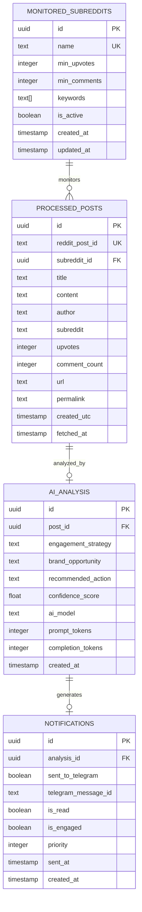
```mermaid
erDiagram
    MONITORED_SUBREDDITS ||--o{ PROCESSED_POSTS : monitors
    PROCESSED_POSTS ||--o| AI_ANALYSIS : analyzed_by
    AI_ANALYSIS ||--o| NOTIFICATIONS : generates

    MONITORED_SUBREDDITS {
        uuid id PK
        text name UK
        integer min_upvotes
        integer min_comments
        text[] keywords
        boolean is_active
        timestamp created_at
        timestamp updated_at
    }

    PROCESSED_POSTS {
        uuid id PK
        text reddit_post_id UK
        uuid subreddit_id FK
        text title
        text content
        text author
        text subreddit
        integer upvotes
        integer comment_count
        text url
        text permalink
        timestamp created_utc
        timestamp fetched_at
    }

    AI_ANALYSIS {
        uuid id PK
        uuid post_id FK
        text engagement_strategy
        text brand_opportunity
        text recommended_action
        float confidence_score
        text ai_model
        integer prompt_tokens
        integer completion_tokens
        timestamp created_at
    }

    NOTIFICATIONS {
        uuid id PK
        uuid analysis_id FK
        boolean sent_to_telegram
        text telegram_message_id
        boolean is_read
        boolean is_engaged
        integer priority
        timestamp sent_at
        timestamp created_at
    }
```

---

## Technology Stack Summary

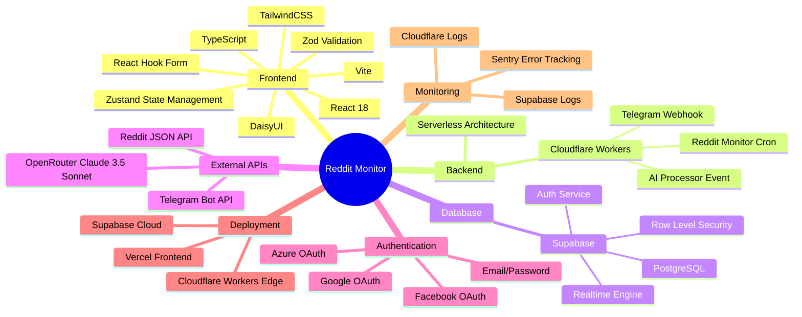
```mermaid
mindmap
  root((Reddit Monitor))
    Frontend
      React 18
      TypeScript
      Vite
      TailwindCSS
      DaisyUI
      Zustand State Management
      React Hook Form
      Zod Validation
    Backend
      Cloudflare Workers
        Reddit Monitor Cron
        AI Processor Event
        Telegram Webhook
      Serverless Architecture
    Database
      Supabase
        PostgreSQL
        Realtime Engine
        Auth Service
        Row Level Security
    External APIs
      Reddit JSON API
      OpenRouter Claude 3.5 Sonnet
      Telegram Bot API
    Authentication
      Email/Password
      Google OAuth
      Facebook OAuth
      Azure OAuth
    Deployment
      Vercel Frontend
      Cloudflare Workers Edge
      Supabase Cloud
    Monitoring
      Cloudflare Logs
      Supabase Logs
      Sentry Error Tracking
```

---

## Summary

This Reddit Monitor system is a comprehensive full-stack application that:

1. **Automatically monitors** Reddit subreddits based on user-configured criteria
2. **Intelligently filters** posts by engagement metrics and keywords
3. **Analyzes opportunities** using AI (Claude 3.5 Sonnet) for authentic engagement strategies
4. **Notifies users** via Telegram for high-confidence opportunities
5. **Provides real-time updates** to the dashboard when new opportunities are found
6. **Manages authentication** with multiple OAuth providers
7. **Scales efficiently** using serverless architecture (Cloudflare Workers)
8. **Maintains data integrity** with PostgreSQL and Row-Level Security

The system is designed to help users identify and engage with Reddit posts in an authentic, value-first manner while subtly promoting their brand or product.
