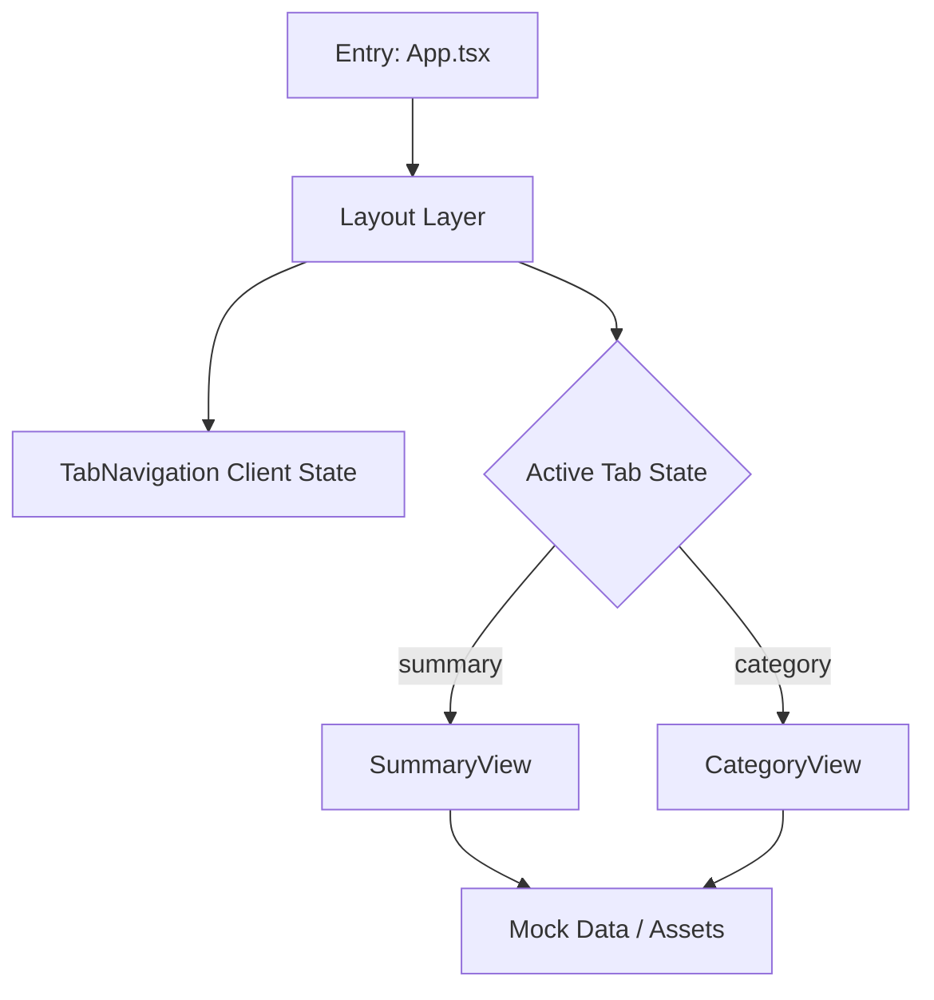
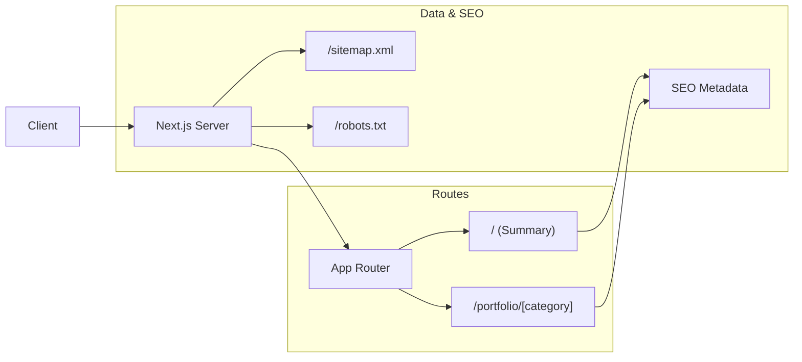
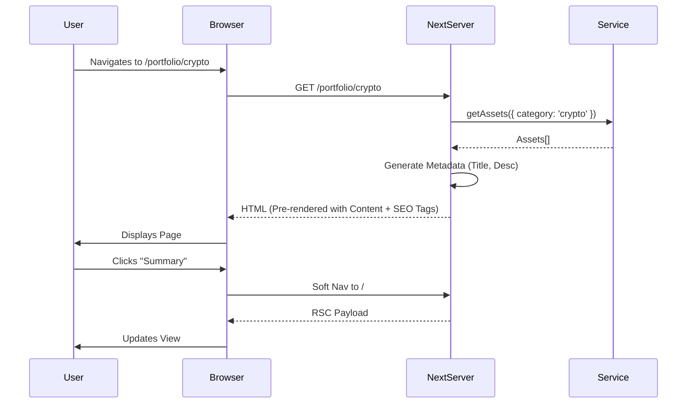

# Implementation Plan - Migration to Next.js & SEO Enhancement

🧠 Principal Architect Mode: Engaged. Analyzing codebase constraints...

## 1. Context Analysis

### 1.1 Files Analyzed
- `package.json`
- `src/App.tsx`
- `src/main.tsx`
- `src/views/SummaryView.tsx`
- `src/views/CategoryView.tsx`
- `src/components/navigation/TabNavigation.tsx`
- `src/types.ts`

### 1.2 Component & Dependency Overview



### 1.3 Current Behavior Summary
- **SPA Architecture:** Uses Vite + React.
- **Routing:** Client-side state (`activeTab`) controls visibility of views; no URL changes when switching tabs.
- **Data:** Mock data (`initialAssets`) loaded in `App.tsx`.
- **SEO:** Non-existent (SPA shell), no meta tags per page, no sitemap.

### 1.4 Problem Statement
The current application lacks URL addressability for specific views (tabs) and has zero SEO capabilities, limiting discoverability and shareability of content.

---

## 2. Proposed Solution

### 2.1 Architecture Summary
- **Framework:** Migrate from Vite to **Next.js 14+ (App Router)**.
- **Routing:** Replace state-based navigation with file-system routing (`/` and `/portfolio/[category]`).
- **Rendering:** Use **Server Components (RSC)** for initial data load and **Client Components** for interactivity (charts, sorting).
- **SEO:** Implement Next.js Metadata API, dynamic sitemap generation, and semantic HTML structure.

### 2.2 Architecture Diagram (Mermaid)



### 2.3 Key Technical Decisions
- **Next.js App Router:** Chosen for built-in SEO handling and performance (RSC).
- **Routing Strategy:** 
    - `app/page.tsx` → Replaces `SummaryView`.
    - `app/portfolio/[category]/page.tsx` → Replaces `CategoryView`.
- **State Management:** 
    - Move mock data to a shared `lib/data.ts` (simulating a service).
    - `Layout` component will persist navigation UI but content will be swapped via routing.
- **SEO Strategy:**
    - **Metadata API:** Generate dynamic titles/descriptions based on categories.
    - **Sitemap:** Auto-generate based on available categories.
    - **Robots.txt:** Allow indexing.

### 2.4 Data Model Changes
- **No Schema Changes:** Data remains mock-based but structured for server access.
- **Data Access:** Create a typed accessor function `getAssets()` to be used by Server Components.

---

### 2.5 Runtime Execution Flow



---

## 3. Detailed Implementation Spec

### A. Project Structure & Configuration
* **Changes Needed:** 
    - Install `next`, `react`, `react-dom`.
    - Remove `vite`, `@vitejs/plugin-react`, `index.html`.
    - Create `next.config.js`.

### B. `src/lib/data.ts` (New)
* **Purpose:** Centralize data access for Server Components.
* **Pseudo-code:**
```typescript
import { initialAssets, categories } from '@/mocks/data';

export function getAssets() { return initialAssets; }
export function getCategories() { return categories; }
export function getCategoryById(id: string) { 
  return categories.find(c => c.id === id); 
}
```

### C. `app/layout.tsx` (New)
* **Purpose:** Root layout with `<html>`, `<body>`, and Navigation.
* **Changes:** 
    - Move `Theme`, `Toast`, `AuthErrorHandler` here.
    - Render `children`.

### D. `src/components/navigation/TabNavigation.tsx`
* **Changes:**
    - Convert `onClick` handlers to `Link` components from `next/link`.
    - Use `usePathname` to determine `activeTab`.
    - **Pseudo-code:**
```typescript
// ...
const pathname = usePathname();
const isActive = (id: string) => {
  if (id === 'summary') return pathname === '/';
  return pathname === `/portfolio/${id}`;
};
// ...
<Link href={cat.id === 'summary' ? '/' : `/portfolio/${cat.id}`}>
  <Tab ... />
</Link>
```

### E. `app/page.tsx`
* **Purpose:** Summary View (Home).
* **SEO:**
```typescript
export const metadata: Metadata = {
  title: 'Portfolio Summary | PixelPerfect',
  description: 'Overview of asset allocation and performance.',
};
```

### F. `app/portfolio/[category]/page.tsx`
* **Purpose:** Dynamic Category View.
* **SEO:**
```typescript
export async function generateMetadata({ params }): Promise<Metadata> {
  const category = getCategoryById(params.category);
  return {
    title: `${category.name} Portfolio | PixelPerfect`,
    description: `Detailed view of ${category.name} assets.`,
  };
}
```

### G. `app/sitemap.ts` & `app/robots.ts`
* **Purpose:** Discovery.
* **Implementation:**
    - `sitemap.ts`: Return entries for `/` and all `/portfolio/[category]`.
    - `robots.ts`: Allow all.

---

## 4. Step-by-Step Execution Plan

### Phase 1: Infrastructure & Setup
- [ ] Uninstall Vite dependencies; Install Next.js dependencies.
- [ ] Initialize `app/` directory structure.
- [ ] Create `src/lib/data.ts` for centralized data access.
- [ ] Configure `next.config.js` and `tsconfig.json` for Next.js.

### Phase 2: Core Application Migration
- [ ] Implement `app/layout.tsx` (Root Layout).
- [ ] Refactor `TabNavigation` to use `next/link` and `usePathname`.
- [ ] Migrate `SummaryView` logic to `app/page.tsx`.
- [ ] Migrate `CategoryView` logic to `app/portfolio/[category]/page.tsx`.
- [ ] Verify global styles and Tailwind configuration.

### Phase 3: SEO & Optimization
- [ ] Add `metadata` export to `app/layout.tsx` (Global defaults).
- [ ] Add `metadata` export to `app/page.tsx`.
- [ ] Implement `generateMetadata` in `app/portfolio/[category]/page.tsx`.
- [ ] Create `app/sitemap.ts` to list all category routes.
- [ ] Create `app/robots.ts`.

---

## 5. Testing Strategy

### Unit Tests
- **Navigation:** Verify active state logic with `usePathname`.
- **Data Access:** Verify `getAssets` returns correct data.

### Integration Tests (SEO Focused)
- **Metadata Check:** 
    - Visit `/portfolio/crypto` → Inspect `<head>` for "Crypto Portfolio".
    - Visit `/` → Inspect `<head>` for "Summary".
- **Sitemap:** Access `/sitemap.xml` → verify valid XML with all categories.

### Edge Cases

| Scenario | Expected Behavior |
| --- | --- |
| Invalid Category URL | Show 404 Not Found page |
| Missing Metadata | Fallback to default Layout metadata |
| Empty Asset List | Render view with "No assets" state, but valid SEO |

---

## 6. Acceptance Criteria

- [ ] Application builds with `next build` without errors.
- [ ] Navigation between tabs changes URL (`/` ↔ `/portfolio/crypto`).
- [ ] Hard refresh on a category page (e.g., `/portfolio/stocks`) loads correctly (SSR).
- [ ] Page source contains correct `<title>` and `<meta name="description">` tags.
- [ ] `/sitemap.xml` exists and lists all categories.
- [ ] `/robots.txt` exists and allows crawling.
- [ ] UI Visuals remain identical to original Vite version.

---

## 7. Verification & Rollback

- **Success Criteria:** Lighthouse SEO score > 90; All pages addressable via URL.
- **Rollback Plan:** Revert `package.json` to Vite scripts and restore `src/App.tsx` as entry point.

